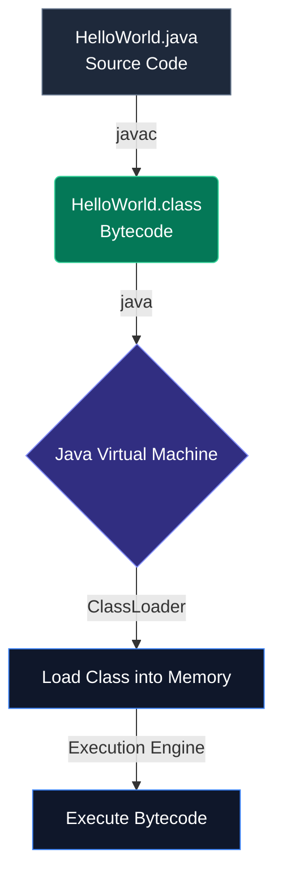

When you open a Java file for the first time, it can look a bit overwhelming compared to Python or JavaScript. Java is notoriously verbose, but that verbosity provides strict structure, type safety, and predictability. Let's break down the classic "Hello World" to the molecular level.

## 1. Setting Up Your Workspace (Where & How to Create)

In Java, the directory structure on your hard drive **must** exactly match your package names. You cannot simply drop a Java file anywhere on your Desktop.

Let's build a proper project structure. Open your terminal and run these commands:

**For Mac / Linux:**
```bash
# 1. Create a root project folder and the nested package directories
mkdir -p my-java-project/src/com/javahub/basics

# 2. Navigate into your root project directory
cd my-java-project

# 3. Create the Java file inside the exact package directory
touch src/com/javahub/basics/HelloWorld.java
```

**For Windows (PowerShell):**
```powershell
# 1. Create the directories
New-Item -ItemType Directory -Force -Path my-java-project\src\com\javahub\basics

# 2. Navigate into your root project directory
cd my-java-project

# 3. Create the Java file
New-Item -ItemType File -Force -Path src\com\javahub\basics\HelloWorld.java
```

Your directory structure should now look exactly like this:
```text
my-java-project/
└── src/
    └── com/
        └── javahub/
            └── basics/
                └── HelloWorld.java
```

## 2. The Molecular Level: Writing the Code

Open `HelloWorld.java` in your IDE (like IntelliJ IDEA, VS Code, or Eclipse) and paste the following code:

```java
package com.javahub.basics; // 1. Package Declaration

import java.util.Date;        // 2. Import Statements

// 3. Class Declaration
public class HelloWorld {
    
    // 4. The Main Method (Entry Point)
    public static void main(String[] args) {
        System.out.println("Hello, World!");
        System.out.println("Current time: " + new Date());
    }
}
```

### Breaking Down the Architecture

Let's dissect this file component by component.

#### 1. Package Declaration
```java
package com.javahub.basics;
```
Packages are Java's way of organizing files and preventing naming conflicts. Think of them as directories. If two classes are named `HelloWorld`, they won't conflict if they are in different packages. By convention, package names are reversed internet domain names.

#### 2. Import Statements
```java
import java.util.Date;
```
If you want to use a class from another package (like the built-in `Date` class), you must import it. The `java.lang` package (which contains `System` and `String`) is imported automatically into every Java file, which is why we never need to import it explicitly.

#### 3. The Class Definition
```java
public class HelloWorld { ... }
```
In Java, **everything** must reside inside a class. You cannot have standalone functions floating around.
- `public`: An access modifier meaning this class is accessible from anywhere.
- `class`: The keyword used to declare a class.
- `HelloWorld`: The name of the class. 

> [!CAUTION]
> The name of the public class **must** exactly match the filename. `public class HelloWorld` must be saved in `HelloWorld.java`.

#### 4. The Main Method
```java
public static void main(String[] args) { ... }
```
This exact method signature is the **entry point** of your application. When you tell the JVM to run your program, it searches specifically for this exact signature.
- `public`: JVM needs to be able to access this method from outside the class.
- `static`: Means the JVM can run this method *without* having to instantiate an object of `HelloWorld` first.
- `void`: The return type. It means this method returns nothing when it finishes.
- `String[] args`: An array of strings that stores command-line arguments passed to the program.

## The Compilation & Execution Lifecycle

Java's mantra is "Write Once, Run Anywhere". To achieve this, it uses a two-step process: **Compilation** and **Interpretation**.



### Step 1: Compilation (Front-End)
When you compile a packaged class, you should run `javac` from your project's root directory:
```bash
# Ensure you are inside the 'my-java-project' root folder
javac src/com/javahub/basics/HelloWorld.java
```
The compiler checks your syntax and types. If successful, it generates `HelloWorld.class` right next to your source file. This file does not contain machine code; it contains **bytecode**, a highly optimized set of instructions designed for the JVM, not your physical CPU.

### Step 2: Execution (Back-End)
When you run the JVM, you must specify the **classpath** (`-cp`) so it knows where your compiled root is, and then provide the **fully qualified class name** (the package + class name):
```bash
java -cp src com.javahub.basics.HelloWorld
```
The JVM takes over. It loads the `.class` file, verifies the bytecode for security issues, and then the Execution Engine takes over. The JVM's **Just-In-Time (JIT) Compiler** translates the bytecode into native machine code on the fly for your specific operating system (Windows, Mac, Linux).

## Deep Dive: Viewing the Bytecode

To truly understand what the JVM sees, we can disassemble the `.class` file using the `javap` plumbing tool:

```bash
javap -c HelloWorld.class
```

**Output:**
```java
Compiled from "HelloWorld.java"
public class com.javahub.basics.HelloWorld {
  public com.javahub.basics.HelloWorld();
    Code:
       0: aload_0
       1: invokespecial #1                  // Method java/lang/Object."<init>":()V
       4: return

  public static void main(java.lang.String[]);
    Code:
       0: getstatic     #7                  // Field java/lang/System.out:Ljava/io/PrintStream;
       3: ldc           #13                 // String Hello, World!
       5: invokevirtual #15                 // Method java/io/PrintStream.println:(Ljava/lang/String;)V
       8: return
}
```

Notice a few incredible things happening here:
1. **The Hidden Constructor:** Even though we didn't write a constructor, the compiler automatically inserted a default `public HelloWorld()` constructor that calls `super()` (`Object."<init>"`).
2. **Opcodes:** The `System.out.println` statement translates to exactly three bytecode instructions: `getstatic` (load the output stream), `ldc` (load the constant string), and `invokevirtual` (invoke the method).

---

## 🎯 Interview Questions

**Why must the main method be declared as `static`?**
> *Answer:* The `main` method must be `static` so that the JVM can invoke it without having to instantiate an object of the class first. If it were not static, the JVM wouldn't know how to create the object (what constructor to use?) to call the method.

**What is the difference between `JDK`, `JRE`, and `JVM`?**
> *Answer:* The **JVM** (Java Virtual Machine) executes the bytecode. The **JRE** (Java Runtime Environment) contains the JVM plus standard libraries needed to run programs. The **JDK** (Java Development Kit) contains the JRE plus development tools like the compiler (`javac`) and disassembler (`javap`).

**Can you overload the `main` method in Java?**
> *Answer:* Yes, you can have multiple methods named `main` with different parameters. However, the JVM will only use the specific signature `public static void main(String[] args)` as the entry point of the program.
