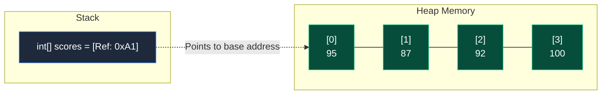

Before diving into complex Object-Oriented design and dynamic Collections, you must understand the most fundamental data structure in computer science: the **Array**.

An array is a container object that holds a fixed number of values of a single type. The length of an array is established when the array is created. After creation, its length is absolutely immutable.

## 1. Memory Layout (Contiguous Memory)

Why are arrays so incredibly fast for reading data? Because arrays allocate **contiguous** (back-to-back) blocks of memory on the Heap.



Because the memory is contiguous, the JVM can instantly calculate the exact memory address of *any* element using a simple mathematical formula: `BaseAddress + (Index * SizeOfDataType)`. This provides **O(1)** time complexity for read operations.

## 2. 1D Arrays: Syntax and Initialization

There are three primary ways to create an array in Java.

### Method 1: Declaration and Allocation
```java
// 1. Declare the array reference
int[] scores; 

// 2. Allocate memory for 5 integers on the Heap
scores = new int[5]; 

// 3. Initialize elements (Default is 0)
scores[0] = 95;
scores[1] = 87;
```

### Method 2: Combined
```java
int[] scores = new int[5];
```

### Method 3: Inline Initialization (Array Literal)
If you already know the values, you can populate the array immediately.
```java
String[] heroes = {"Batman", "Superman", "Wonder Woman"};
```

> [!WARNING]
> Array indices are **Zero-Indexed**. An array of size 5 has valid indices from `0` to `4`. Attempting to access `scores[5]` will instantly throw an `ArrayIndexOutOfBoundsException` and crash your program.

## 3. Multidimensional Arrays (Matrices)

Java handles 2D arrays slightly differently than languages like C++. In Java, a 2D array is technically an **"Array of Arrays"**.

```java
// A 3x3 matrix (Grid)
int[][] grid = new int[3][3];

grid[0][0] = 1; // Top-left corner
grid[2][2] = 9; // Bottom-right corner
```

### Inline 2D Initialization
```java
int[][] matrix = {
    {1, 2, 3},
    {4, 5, 6},
    {7, 8, 9}
};
```

### Jagged Arrays
Because a 2D array is just an array of arrays, the inner arrays do not have to be the exact same length! This creates a "jagged" array.
```java
int[][] jagged = new int[3][];
jagged[0] = new int[2];
jagged[1] = new int[5]; // Different length!
jagged[2] = new int[1];
```

## 4. Traversing Arrays

The enhanced `for-each` loop is the cleanest way to iterate through an array if you don't need the index.

```java
int[] numbers = {10, 20, 30, 40};

// Traditional For Loop (When you need the index `i`)
for (int i = 0; i < numbers.length; i++) {
    System.out.println("Index " + i + ": " + numbers[i]);
}

// Enhanced For-Each Loop (Cleanest)
for (int num : numbers) {
    System.out.println(num);
}
```

## 5. The `java.util.Arrays` Utility Class

Java provides a powerful utility class to perform common operations on arrays without having to write boilerplate loops.

```java
import java.util.Arrays;

int[] data = {5, 2, 9, 1, 6};

// 1. Sorting an array in-place (Dual-Pivot Quicksort)
Arrays.sort(data); 

// 2. Binary Search (Array MUST be sorted first)
int index = Arrays.binarySearch(data, 9); 

// 3. Printing an array (Otherwise it prints the memory hash!)
System.out.println(Arrays.toString(data)); // "[1, 2, 5, 6, 9]"

// 4. Printing a 2D array
int[][] matrix = {{1, 2}, {3, 4}};
System.out.println(Arrays.deepToString(matrix));
```

---

## 🎯 Interview Questions

**1. What is the time complexity to access an element in an array by its index?**
> *Answer:* `O(1)`. Because arrays are allocated in contiguous memory blocks, the JVM can directly calculate the memory address of the index instantly.

**2. What happens if you try to print an array directly using `System.out.println(myArray)`?**
> *Answer:* It will print the object's class name and memory hashcode (e.g., `[I@1b6d3586`). To print the actual contents, you must use `Arrays.toString(myArray)`.

**3. What is an `ArrayIndexOutOfBoundsException`?**
> *Answer:* It is an unchecked runtime exception thrown when attempting to access an array index that is either negative or greater than or equal to the size of the array.

**4. Are array lengths mutable in Java?**
> *Answer:* No. Once an array is instantiated on the heap (e.g., `new int[5]`), its length is strictly fixed. To resize an array, you must create a brand new array and copy the elements over (which is exactly how `ArrayList` works under the hood).
