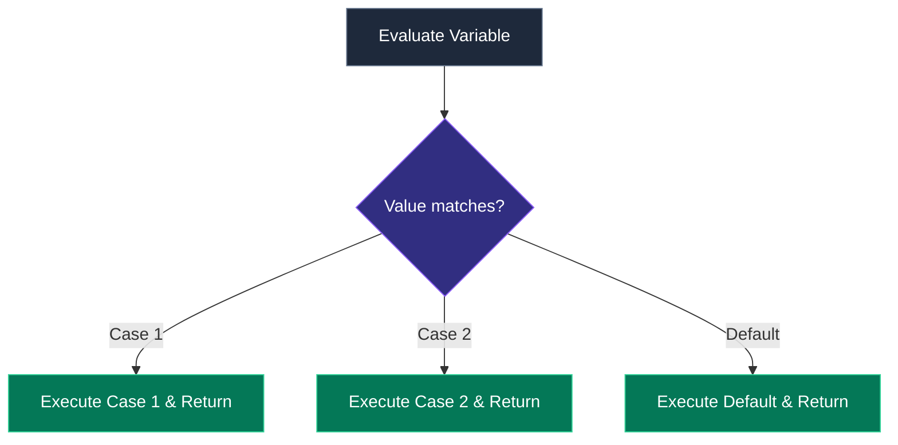

Programs are useless if they only execute straight down from top to bottom. **Control flow** allows your application to make decisions, skip code, or repeat operations based on dynamic conditions. 

In Java, control flow is strictly governed by `boolean` expressions (`true` or `false`). Unlike Python or JavaScript, Java does not have "truthy" or "falsy" values (you cannot use `if (1)` or `if ("string")`).

## 1. Conditional Branching (`if-else`)

The `if-else` statement is the fundamental decision-making structure.

```java
int creditScore = 750;

if (creditScore >= 800) {
    System.out.println("Excellent! You get the lowest interest rate.");
} else if (creditScore >= 700) {
    System.out.println("Good! You qualify for a standard loan.");
} else {
    System.out.println("Sorry, you need a co-signer.");
}
```

### The Ternary Operator
For simple assignments, the ternary operator (`? :`) is a concise alternative to `if-else`.

```java
boolean isVip = true;
// syntax: condition ? valueIfTrue : valueIfFalse;
double discount = isVip ? 0.20 : 0.05;
```

## 2. Modern Switch Expressions (Java 14+)

Historically, `switch` statements in Java were clunky, prone to "fall-through" bugs (forgetting a `break` statement), and verbose. Java 14 revolutionized the `switch` with **Switch Expressions**.



**Old Switch Statement (Pre-Java 14):**
```java
String day = "MONDAY";
String type;

switch (day) {
    case "MONDAY":
    case "TUESDAY":
    case "WEDNESDAY":
    case "THURSDAY":
    case "FRIDAY":
        type = "Weekday";
        break; // DANGEROUS: If you forget this, it falls through!
    case "SATURDAY":
    case "SUNDAY":
        type = "Weekend";
        break;
    default:
        type = "Unknown";
}
```

**Modern Switch Expression (Java 14+):**
Notice the beautiful `->` syntax. No `break` statements are needed, and it returns a value directly!
```java
String day = "MONDAY";

String type = switch (day) {
    case "MONDAY", "TUESDAY", "WEDNESDAY", "THURSDAY", "FRIDAY" -> "Weekday";
    case "SATURDAY", "SUNDAY" -> "Weekend";
    default -> "Unknown";
}; // Notice the semicolon here, because it's an assignment expression!
```

## 3. Looping Mechanisms

When you need to repeat a block of code, you use loops.

### The `for` Loop
Best used when you know *exactly* how many times you want to iterate.
```java
// Initialization ; Condition ; Increment/Decrement
for (int i = 0; i < 5; i++) {
    System.out.println("Iteration: " + i);
}
```

### The Enhanced `for-each` Loop
Introduced in Java 5, this is the preferred way to iterate over arrays and collections. It prevents "Off-by-One" errors.
```java
String[] frameworks = {"Spring", "Hibernate", "Micronaut"};

// "For each String 'framework' in the 'frameworks' array..."
for (String framework : frameworks) {
    System.out.println("I love " + framework);
}
```

### The `while` and `do-while` Loops
Used when you don't know how many iterations are needed, but you want to loop until a condition becomes `false`.

```java
int connectionAttempts = 0;

// The while loop checks the condition BEFORE executing. It might execute 0 times.
while (connectionAttempts < 3) {
    System.out.println("Trying to connect...");
    connectionAttempts++;
}

// The do-while loop executes the code block FIRST, then checks the condition.
// It is guaranteed to run at least 1 time.
int pinTries = 0;
do {
    System.out.println("Please enter your PIN:");
    pinTries++;
} while (pinTries < 3);
```

## 4. Break, Continue, and Labels

You can manipulate the flow inside a loop using `break` and `continue`.

- **`break`**: Immediately exits the entire loop.
- **`continue`**: Skips the rest of the current iteration and jumps to the next one.

### Deep Dive: Loop Labels
What happens if you have nested loops and you want to break out of the *outer* loop from the *inner* loop? You use **labels**.

```java
outerLoop: // This is a label!
for (int i = 1; i <= 3; i++) {
    for (int j = 1; j <= 3; j++) {
        if (i == 2 && j == 2) {
            System.out.println("Breaking out of everything!");
            break outerLoop; // Stops both the inner AND the outer loop
        }
        System.out.println("i=" + i + ", j=" + j);
    }
}
```

## 5. Unreachable Code Errors

One of Java's strictest compile-time checks revolves around control flow. If the compiler determines that a line of code is absolutely impossible to reach, it will refuse to compile the program. This saves you from dead code bugs.

```java
public void checkStatus() {
    System.out.println("Starting check...");
    return;
    
    // ERROR: Unreachable code! The compiler knows the return 
    // statement guarantees this will never execute.
    // System.out.println("Finished check"); 
}
```
This is particularly common when dealing with `while (true)` loops or unconditional `break`/`continue` statements.

## 6. Experimenting in the Terminal (JShell)

Let's test the modern switch expression directly in the terminal.

**For Windows (CMD/PowerShell) / Mac / Linux:**
```bash
jshell
```

```java
// Inside JShell
jshell> int status = 404;
status ==> 404

jshell> String message = switch(status) {
   ...>     case 200 -> "OK";
   ...>     case 404 -> "Not Found";
   ...>     case 500 -> "Server Error";
   ...>     default -> "Unknown Status";
   ...> };
message ==> "Not Found"

jshell> System.out.println(message);
Not Found
```

---

## 🎯 Interview Questions

**Does Java evaluate `if(1)` as `true`?**
> *Answer:* No. Unlike C++ or JavaScript, Java requires strict `boolean` types (`true` or `false`) inside `if` and `while` conditions. `if(1)` will result in a compile-time error.

**What is the primary difference between a `while` loop and a `do-while` loop?**
> *Answer:* A `while` loop evaluates its condition *before* executing the block, meaning it can execute zero times. A `do-while` loop evaluates its condition *after* executing the block, guaranteeing that the block runs at least once.

**Why is the modern Switch Expression (Java 14+) superior to the old Switch Statement?**
> *Answer:* The modern switch expression uses the `->` syntax which completely eliminates "fall-through" errors by not requiring `break` statements. It also allows the switch block to return a value directly, acting as an expression rather than just a statement.
