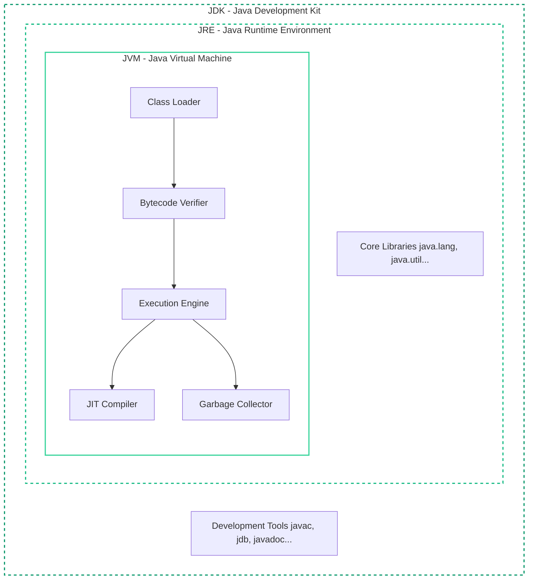

Before writing a single line of Java code, you must understand the environment it runs in. The Java ecosystem is incredibly powerful, but its architecture is fundamentally different from languages like C++ or Python.

Setting up a robust development environment is the very first step to becoming a Java God. But to truly master it, you must understand *why* the environment is built this way.

---

## 1. The Holy Trinity: JDK, JRE, and JVM

If you've searched for "How to install Java", you've been bombarded with acronyms. Understanding the difference between these three components is a guaranteed interview question.

Here is the exact architectural relationship between them:



### The JVM (Java Virtual Machine)
The JVM is the absolute heart of the ecosystem. It is an abstract computing machine that enables your computer to run a Java program. 
- **The "Write Once, Run Anywhere" (WORA) Principle**: When you write Java code, you don't compile it into Windows `.exe` or Mac `.app` machine code. You compile it into an intermediate language called **Bytecode**.
- The JVM is essentially a virtual computer running inside your actual computer. It takes this generic bytecode and translates it into the specific machine code that your operating system (Windows, Mac, Linux) understands *on the fly*. 

### The JRE (Java Runtime Environment)
The JRE is the software package that contains everything needed to *run* a compiled Java program.
- It contains the **JVM**.
- It contains the **Java Class Libraries** (the standard code like `java.lang.String` and `java.util.List`).

### The JDK (Java Development Kit)
The JDK is the full toolkit for Java *developers*.
- It contains the complete **JRE**.
- It contains development tools like the compiler (`javac`), the archiver (`jar`), the documentation generator (`javadoc`), and the debugger (`jdb`).

> [!IMPORTANT]
> As a software engineer, **you must install the JDK.** Without the JDK, you cannot compile `.java` files into `.class` bytecode files.

---

## 2. Deep Dive: What exactly is Bytecode?

You'll hear the term "Bytecode" constantly, but what actually *is* it?

When you run the `javac HelloWorld.java` command, the Java compiler produces a `HelloWorld.class` file. This file contains the bytecode. If you open this `.class` file in a raw hex editor, you will see a stream of hexadecimal numbers.

### The CAFEBABE Magic Number
Every single valid Java `.class` file in the world begins with the exact same 4 bytes of hexadecimal data: `CA FE BA BE`. 

```text
CA FE BA BE 00 00 00 3D 00 1D 0A 00 06 00 0F 09 ...
```

The JVM's Class Loader reads the file. If the first 4 bytes aren't `CAFEBABE`, it immediately throws a `ClassFormatError` and refuses to run the file. This is called a "Magic Number" in computer science, used to uniquely identify file formats.

### The JIT (Just-In-Time) Compiler
Once the bytecode is loaded, the Execution Engine has to run it.
Historically, the JVM *interpreted* bytecode one line at a time. This was slow.
Modern JVMs use a **JIT Compiler**. As your program runs, the JIT compiler watches your code. If it notices a specific method is being executed thousands of times (a "hot spot"), it will pause, compile that specific bytecode directly into lightning-fast native CPU instructions, and cache it. The next time that method is called, it runs at the native speed of C++!

---

## 3. Choosing and Installing a JDK distribution

Oracle used to be the sole provider of Java. Today, Java is open-source (OpenJDK), and many companies provide their own pre-packaged distributions.

**Top Recommendations:**
1. **Amazon Corretto**: Highly optimized, free, and comes with long-term support (LTS) from AWS.
2. **Eclipse Adoptium (Temurin)**: The community standard, highly reliable.
3. **GraalVM**: An advanced JDK that supports Ahead-of-Time (AOT) compilation for lightning-fast startups. *(We will cover this in Level 8)*.

### macOS (Using Homebrew)
```bash
# Update your homebrew repositories
brew update

# Install the latest LTS version of Amazon Corretto
brew install --cask corretto
```

### Windows (Using Winget)
Open PowerShell as Administrator and run the Windows Package Manager:
```powershell
winget install Amazon.Corretto.21
```

---

## 4. The Path and JAVA_HOME Variables

Historically, simply installing Java wasn't enough. You had to manually tell your operating system where the Java executable was located so you could run it from any terminal window. 

### What is JAVA_HOME?
Many enterprise tools (like Maven, Gradle, Tomcat, and Kafka) need to know exactly where your JDK is installed. They look for an environment variable named `JAVA_HOME`.

**Finding your installation path:**
- **Windows**: Usually `C:\Program Files\Amazon Corretto\jdk21.0.x_x`
- **macOS**: `/Library/Java/JavaVirtualMachines/amazon-corretto-21.jdk/Contents/Home`

> [!CAUTION]
> If a build tool complains about "Java compiler not found", 99% of the time, your `JAVA_HOME` environment variable is either missing or pointing to a JRE instead of a JDK!

---

## 5. Verifying Your Installation

Open a completely fresh terminal window. The terminal loads environment variables on startup, so an old window won't see your new Java installation.

### Check the Runtime
```bash
java -version
```

### Check the Compiler
```bash
javac -version
```

---

## 🎯 Interview Questions

**1. What is the difference between the JDK, JRE, and JVM?**
> *Answer:* The **JVM** (Java Virtual Machine) executes compiled bytecode line-by-line. The **JRE** (Java Runtime Environment) includes the JVM and the core class libraries needed to run Java applications. The **JDK** (Java Development Kit) includes the JRE and development tools like the compiler (`javac`), needed to write and compile code.

**2. Why is Java considered platform-independent?**
> *Answer:* Because of the "Write Once, Run Anywhere" paradigm. Java code is not compiled directly into OS-specific machine code. Instead, it is compiled into an intermediate bytecode (`.class` files). The JVM, which is platform-specific, translates this bytecode into machine instructions at runtime.

**3. What is the JIT Compiler, and how does it improve performance?**
> *Answer:* The Just-In-Time (JIT) compiler is a component of the JVM's execution engine. Instead of interpreting bytecode line-by-line constantly, it identifies "hot" (frequently executed) methods and compiles them down to native machine code at runtime. This cached native code runs vastly faster on subsequent invocations.

**4. What is the `CAFEBABE` magic number?**
> *Answer:* `CAFEBABE` is the hexadecimal magic number that occupies the first 4 bytes of every valid compiled Java `.class` file. The JVM's ClassLoader checks for this signature to verify the file format before loading it into memory.

**5. What is the difference between the HotSpot JVM and GraalVM?**
> *Answer:* HotSpot is the standard, traditional JVM implementation used in OpenJDK that relies heavily on Just-In-Time (JIT) compilation to optimize code during runtime. GraalVM is a high-performance JDK distribution that includes a new compiler and supports Ahead-Of-Time (AOT) compilation, allowing Java applications to be compiled directly into native executables for near-instant startup times.
