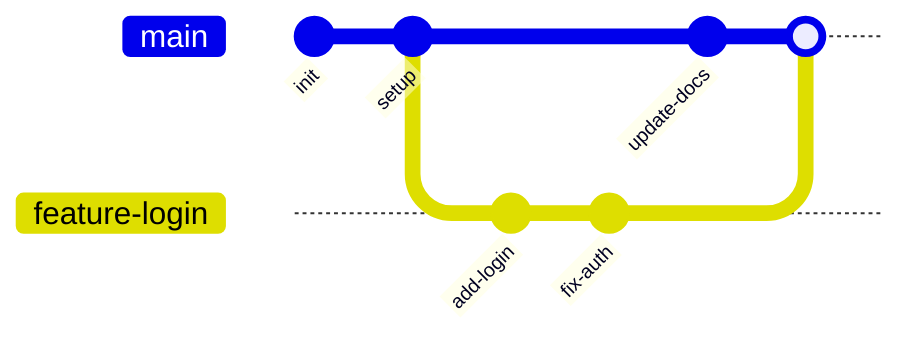
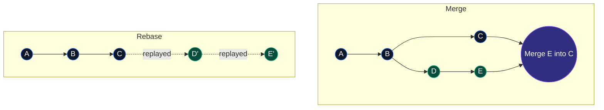

Most tutorials teach Git as a series of magical CLI commands. To achieve mastery, we must peel back the abstraction and understand Git for what it truly is: **a distributed, content-addressable key-value store** overlaid with a Directed Acyclic Graph (DAG).

## 1. The Core Philosophy: Snapshots, Not Deltas

A fundamental difference between Git and older VCS (like Subversion) is how data is modeled. SVN stores *deltas* (file-based changes). Git stores *snapshots*. 

Every time you commit, Git essentially takes a picture of what all your files look like at that moment. To be efficient, if files have not changed, Git doesn't store the file again—it just stores a link to the previous identical file it has already stored.

## 2. The Git Architecture & Lifecycle

The Git workflow spans four distinct "areas." Understanding how data flows between them is crucial.


1. **Working Directory:** The actual files on your disk that you modify.
2. **Staging Area (The `index`):** A file (usually `.git/index`) containing information about what will go into your next commit.
3. **Local Repository (`.git` directory):** The database where Git stores metadata and object snapshots.
4. **Remote Repository:** A hosted version of your repository (e.g., GitHub, GitLab).

> [!TIP]
> The Staging Area is your best friend. It allows you to craft granular, logical commits by picking exactly which modified lines should be included in the next snapshot.

## 3. Git Internals: The Object Database

When you type `git init`, Git creates a `.git` directory. Inside `.git/objects`, Git stores all its data as objects addressed by their **SHA-1 hash**.

There are three primary object types you need to know:
1. **Blob (Binary Large Object):** Represents file contents. It doesn't store the filename, only the raw data.
2. **Tree:** Represents a directory structure. A tree object maps filenames to the SHA-1 hashes of blobs (files) or other trees (subdirectories).
3. **Commit:** A tiny text file containing metadata. It points to the top-level tree object, the parent commit(s), the author, timestamp, and commit message.

### Anatomy of a Commit Object

If we use a low-level Git plumbing command (`git cat-file -p <hash>`) to inspect a commit object, here is exactly what it looks like:

```text
tree 92b8b694fc1102c64b22cbb24250325492d24263
parent 12a14e9f3ebc7512d506d8705a2e6f49e4198124
author Jane Doe <jane@example.com> 1625123456 -0400
committer Jane Doe <jane@example.com> 1625123456 -0400

Refactor the payment processing module
```

Notice the architecture:
- The **commit** points to a **tree**.
- The **tree** represents the entire snapshot of the project.
- The **parent** points to the previous commit, creating the DAG (Directed Acyclic Graph) of your history.

## 4. Cryptographic Integrity

Everything in Git is checksummed before it is stored. The checksum mechanism Git uses is the **SHA-1 hash**, a 40-character hexadecimal string.

Because the hash of a commit is derived from the contents of the tree it points to, its parent commit's hash, and its own metadata, **it is impossible to alter history without Git noticing.** Changing a single byte in a file changes the blob hash, which changes the tree hash, which changes the commit hash, which changes all subsequent commit hashes.

> [!WARNING]
> This strict integrity is why commands that rewrite history (like `git rebase` or `git commit --amend`) actually create *entirely new commit objects* with new SHA-1 hashes, rather than modifying the existing ones.

## 5. Branching and the DAG

Many developers fear branching because in older VCS, it meant copying all files. In Git, a branch is astonishingly lightweight: it is simply a **movable pointer** to a specific commit.

When you run `git branch feature`, Git simply creates a new text file containing the 40-character SHA-1 of your current commit. It takes milliseconds. The special pointer `HEAD` tells Git which branch you currently have checked out.



To visualize this graph directly in your terminal, use this essential alias:
```bash
git log --graph --oneline --all
```

## 6. Advanced Workflow Imperatives

To be a senior engineer, your use of Git must be deliberate.

- **Atomic Commits:** Each commit should do exactly one thing and leave the codebase in a compilable state.
- **Meaningful Messages:** "Fix bug" is unacceptable. Your message should explain *why* the change was made, not *what* changed.

### Rebase vs. Merge

Understanding when to merge and when to rebase is critical for maintaining a clean history.

**Merge** takes two diverging branches and ties them together with a *merge commit*. It is non-destructive but can create a messy, web-like history if overused.

**Rebase** takes your commits from a feature branch and "replays" them one-by-one on top of another branch. It rewrites history, creating new SHAs, but results in a beautifully linear, readable history.



> [!CAUTION]
> **The Golden Rule of Rebasing:** Never rebase commits that you have pushed to a public repository. It rewrites history, and will cause massive headaches for your collaborators.

### Resolving Merge Conflicts

When Git cannot automatically merge changes (e.g., two people edited the exact same line), it pauses and marks the file as **Conflicted**. 

If you open the conflicted file, you will see markers like this injected directly into your code:

```java
public class Calculator {
    public int add(int a, int b) {
<<<<<<< HEAD
        // Added logging for production
        System.out.println("Adding " + a + " and " + b);
        return a + b;
=======
        // Fast addition utilizing bitwise operators (experimental)
        return Math.addExact(a, b);
>>>>>>> feature-fast-math
    }
}
```

**To resolve:** Delete the markers (`<<<<<<<`, `=======`, `>>>>>>>`), keep the code you want, save the file, and run `git add <file>` followed by `git commit`.

## 7. The Reflog: Your Safety Net

If you ever make a terrible mistake (like doing a hard reset and losing work), do not panic. Git keeps a log of everywhere your `HEAD` pointer has been for the last 30 days.

```bash
# View the history of your HEAD pointer movements
git reflog

# Output looks like:
# 1a2b3c4 HEAD@{0}: reset: moving to HEAD~2
# 9f8e7d6 HEAD@{1}: commit: Add new login page

# Oh no! I didn't mean to reset! Let's go back:
git reset --hard 9f8e7d6
```
