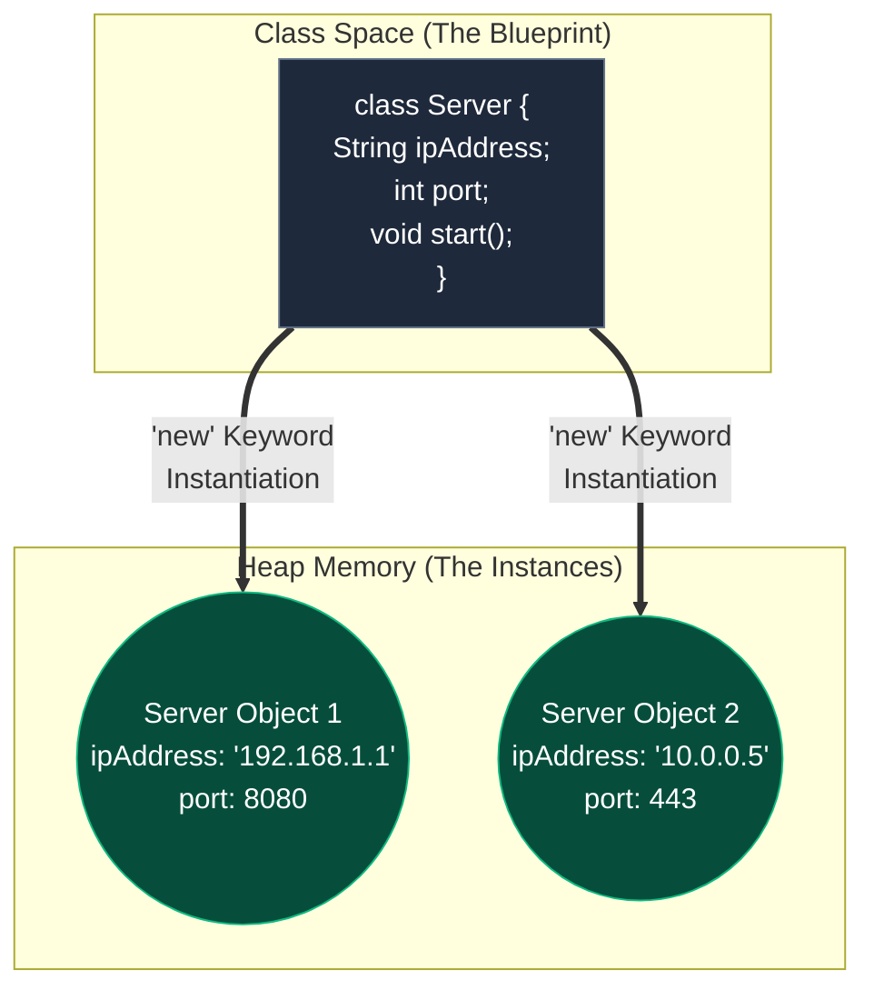

Because Java is an undeniably **Object-Oriented Programming (OOP)** language, attempting to learn variables and control flow without first understanding *where* those variables live is a mistake. 

In Java, you cannot have a standalone function or variable floating in the void. **Everything** must live inside a Class. Let's explore the fundamental building blocks of Java's OOP architecture.

## 1. The Blueprint and The Instance

The core of OOP rests on two intertwined concepts: **Classes** and **Objects**.

- **The Class (The Blueprint)**: A Class is a theoretical design. It defines the properties (state) and methods (behaviors) that a future entity will have. It takes up no functional memory space until it is used.
- **The Object (The Instance)**: An Object is the physical realization of that blueprint in memory (the Heap). You can spawn thousands of unique Objects from a single Class.



## 2. Anatomy of a Java Class

Let's look at how a Class is structured in code. We define the state using **Fields** (variables) and the behavior using **Methods** (functions).

```java
public class Server {
    
    // 1. Fields (State / Properties)
    String ipAddress;
    int port;
    boolean isRunning;

    // 2. The Constructor (Initialization)
    public Server(String ipAddress, int port) {
        this.ipAddress = ipAddress;
        this.port = port;
        this.isRunning = false;
    }

    // 3. Methods (Behaviors / Functions)
    public void start() {
        this.isRunning = true;
        System.out.println("Server " + this.ipAddress + " started on port " + this.port);
    }
}
```

### The Constructor
A **Constructor** is a special method called automatically the moment an Object is created. It must have the *exact* same name as the Class and has *no return type* (not even `void`). Its sole purpose is to set up the initial state of the object.

### The `this` Keyword
Inside a Class, `this` is a reference pointer to the *current object* executing the code. We use `this.ipAddress = ipAddress;` to tell the compiler: "Take the `ipAddress` parameter passed into the constructor, and assign it to *this specific object's* `ipAddress` field."

## 3. Instantiation: The `new` Keyword

A Class is useless until it is instantiated. We use the `new` keyword to create an Object.

When the JVM sees the `new` keyword, a complex sequence of events occurs:
1. The JVM calculates how much memory the Object will need.
2. It allocates that memory on the **Heap**.
3. It initializes the fields to default values (`null` or `0`).
4. It executes the Constructor to set the defined values.
5. It returns the memory address (reference) back to the variable.

```java
public class Main {
    public static void main(String[] args) {
        // 1. Declare      // 2. Instantiate (new)
        Server webServer = new Server("192.168.1.100", 80);
        Server dbServer  = new Server("10.0.0.5", 5432);

        // 3. Invoke Methods
        webServer.start(); 
        // Output: Server 192.168.1.100 started on port 80
    }
}
```

## 4. Object References & The `null` Value

A critical concept in Java is that variables **do not store the object itself**. They only store a **reference** (a memory address pointer) to where the object lives on the Heap.

If you declare a variable but do not instantiate an object using `new`, the variable points to **nothing**. In Java, this "nothing" is represented by the `null` keyword.

```java
public class Main {
    public static void main(String[] args) {
        // Declared, but not instantiated. It points to nothing.
        Server proxyServer = null;
        
        // This will cause a massive crash! (NullPointerException)
        // proxyServer.start(); 
        
        // You must instantiate it before using it:
        proxyServer = new Server("127.0.0.1", 8080);
        proxyServer.start(); // Now it works perfectly.
    }
}
```
Attempting to call a method or access a field on a `null` reference results in the infamous `NullPointerException` (NPE).

## 5. Functions vs. Methods in Java

In languages like Python or JavaScript, you can write a `function` floating outside of any class. 

In Java, **Functions do not exist in a vacuum**. Every function must belong to a Class. Because of this, in Java terminology, we almost exclusively refer to them as **Methods**.

### Method Signatures

A method's signature defines exactly how the outside world interacts with it.

```java
public int calculateLoad(int activeConnections, int maxCapacity) {
    return (activeConnections * 100) / maxCapacity;
}
```

- **`public`**: Access Modifier. The method can be called from outside the Class.
- **`int`**: Return Type. When this method finishes, it promises to return an integer. (If it returns nothing, use `void`).
- **`calculateLoad`**: Method Name. Always use `camelCase` in Java.
- **`(...)`**: Parameters. The data the method requires to execute.

## 6. Experimenting in JShell

You don't need a full IDE to test OOP concepts. Java includes an interactive REPL called `jshell`.

Open your terminal and type `jshell`:

```java
jshell> class Robot {
   ...>     String name;
   ...>     public Robot(String n) { this.name = n; }
   ...>     public void speak() { System.out.println("I am " + this.name); }
   ...> }
|  created class Robot

jshell> Robot bot = new Robot("T-800");
bot ==> Robot@7344699f

jshell> bot.speak();
I am T-800
```
Notice the output `Robot@7344699f`? That hexadecimal string represents the actual memory address on the Heap where your Robot object lives! We will dive deeper into Heap memory and References in the next topic.

---

## 🎯 Interview Questions

**What is the difference between a Class and an Object?**
> *Answer:* A Class is a blueprint or template that defines the state and behavior of an entity. An Object is an instance of that Class allocated in memory.

**What happens exactly when the `new` keyword is used?**
> *Answer:* The JVM allocates memory on the Heap for the new object, initializes all instance variables to their default values, executes the constructor, and returns a reference to the newly created object.

**Can you have a standalone function in Java?**
> *Answer:* No. Java is strictly object-oriented, meaning all functions must be defined as Methods inside a Class.

