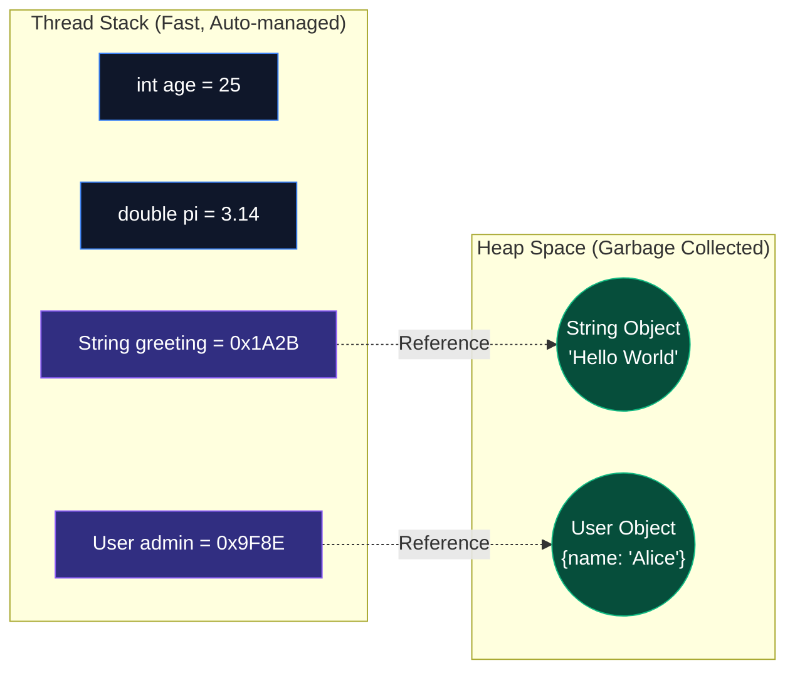
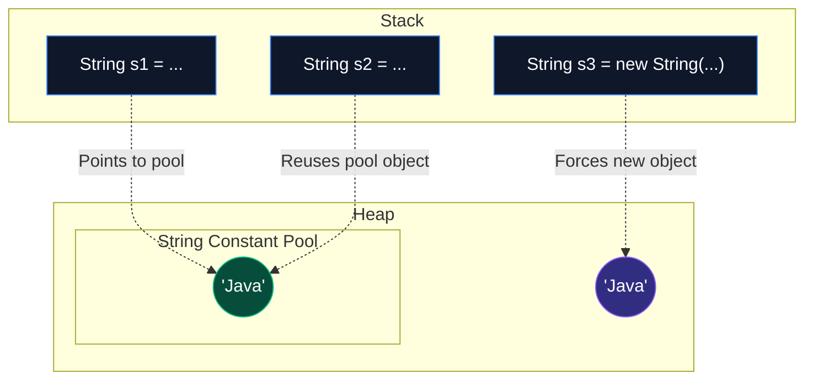

Java is a **statically-typed** language. This means that every variable must be declared with a specific data type before it can be used, and its type cannot change during its lifetime. While this might feel restrictive if you're coming from Python or JavaScript, this strictness allows the compiler to catch massive classes of bugs before your code ever reaches production.

## 1. Primitives vs. References: The Memory Architecture

To truly understand Java variables, you must understand how the JVM manages memory. The JVM divides memory into two primary regions: the **Stack** and the **Heap**.



1. **Primitive Types** (`int`, `double`, `boolean`, etc.) are stored directly on the **Stack**. Accessing them is blazingly fast.
2. **Reference Types** (Objects, Arrays, Strings) store their actual data on the **Heap**. The variable itself simply holds a memory address (reference) on the Stack that points to the Heap.

## 2. The 8 Primitive Data Types

Java has exactly 8 primitive data types. Because they are not objects, they don't have methods or properties, and they are incredibly lightweight.

### Integer Types (Whole Numbers)
1. `byte` (8-bit): -128 to 127
2. `short` (16-bit): -32,768 to 32,767
3. `int` (32-bit): -2^31 to 2^31-1. **(Default choice for whole numbers)**
4. `long` (64-bit): Massive numbers. Append an `L` to the value.

```java
int population = 800_000_000; // You can use underscores for readability!
long globalPopulation = 8_000_000_000L; // Note the 'L'
```

### Floating-Point Types (Decimals)
5. `float` (32-bit): Less precise. Append an `f` to the value.
6. `double` (64-bit): Highly precise. **(Default choice for decimals)**

```java
double pi = 3.14159265359;
float price = 19.99f; // Note the 'f'
```

> [!CAUTION]
> **Never use `float` or `double` for currency calculations!** They use IEEE 754 binary floating-point math, which results in precision loss (e.g., `0.1 + 0.2` might equal `0.30000000000000004`). For money, always use the `BigDecimal` reference class.

### Other Types
7. `boolean` (1-bit logical): Can only be `true` or `false` (not `1` or `0`).
8. `char` (16-bit Unicode): A single character surrounded by single quotes (`'`).

```java
boolean isJavaFun = true;
char grade = 'A';
char omega = '\u03A9'; // Unicode representation of Ω
```

## 3. The String Constant Pool

The `String` class is the most heavily used reference type. Unlike other objects, Java treats Strings with special, highly-optimized mechanics.

Strings in Java are **immutable**. Once created, their data cannot be changed. Because they are immutable, the JVM can safely reuse them. It does this via the **String Constant Pool**, a special area in the Heap.



```java
// Literal assignment: Uses the String Pool
String s1 = "Java";
String s2 = "Java";
System.out.println(s1 == s2); // TRUE! They point to the exact same memory address.

// Using the 'new' keyword: Bypasses the pool
String s3 = new String("Java");
System.out.println(s1 == s3); // FALSE! s3 is a brand new object in standard heap space.
```

## 4. Variable Scope & Shadowing

In Java, a variable's "scope" defines where it can be accessed. A variable only exists within the block of code `{ ... }` where it was declared.

### Block Scope
Variables declared inside a method or an `if` statement cannot be accessed outside of it.

```java
public void calculate() {
    int outer = 10;
    
    if (outer == 10) {
        int inner = 20; // Only exists inside this 'if' block!
        System.out.println(outer + inner);
    }
    
    // ERROR: Cannot resolve symbol 'inner'
    // System.out.println(inner); 
}
```

### Shadowing
If you declare a local variable with the exact same name as an instance variable, the local variable "shadows" (hides) the instance variable. This is why we use the `this` keyword!

```java
public class Person {
    String name;
    
    public void setName(String name) {
        // 'name' refers to the local parameter. 
        // 'this.name' refers to the instance variable.
        this.name = name; 
    }
}
```

## 5. Local Variable Type Inference (`var`)

Historically, Java was notorious for verbose variable declarations: `HashMap<String, List<Integer>> map = new HashMap<String, List<Integer>>();`. 

Starting in Java 10, you can use the `var` keyword to let the compiler automatically infer the type based on the value assigned. 

```java
// The compiler knows this is an int
var age = 25; 

// The compiler knows this is a String
var name = "Alice"; 

// Extremely useful for complex types:
var users = new ArrayList<User>(); 
```

> [!CAUTION]
> `var` is **not** dynamic typing like JavaScript! The variable is still strictly and permanently typed. If you declare `var x = 10;`, you cannot later do `x = "Hello";`—the compiler will reject it because `x` was strictly inferred as an `int`. Additionally, `var` can **only** be used for local variables inside methods, never for class fields.

## 6. Type Casting

Sometimes you need to convert a value from one primitive type to another.

### Widening (Implicit Casting)
Converting a smaller type to a larger type size. Java does this automatically because there is no risk of data loss.
`byte` -> `short` -> `char` -> `int` -> `long` -> `float` -> `double`

```java
int myInt = 9;
double myDouble = myInt; // Automatic casting: myDouble is 9.0
```

### Narrowing (Explicit Casting)
Converting a larger type to a smaller size. You must do this manually because data might be truncated or lost.

```java
double pi = 3.14;
int roundedPi = (int) pi; // Manual casting: roundedPi is 3 (loss of .14)
```

## 7. Wrapper Classes & Autoboxing

While primitive types are incredibly fast, they have a major limitation: **they are not objects**. This becomes a problem when you want to use advanced Java features like Collections (e.g., `ArrayList`), which *only* accept objects.

To solve this, Java provides **Wrapper Classes** that "wrap" primitives inside a standard Heap-allocated Object:
- `int` -> `Integer`
- `double` -> `Double`
- `boolean` -> `Boolean`
- `char` -> `Character`

### Autoboxing and Unboxing
Java automatically converts between primitives and their wrapper classes behind the scenes. This compiler magic is called Autoboxing (primitive to object) and Unboxing (object to primitive).

```java
// Autoboxing: The compiler automatically converts the primitive '5' into an 'Integer' object.
Integer myNumber = 5; 

// Unboxing: The compiler automatically extracts the primitive '5' from the 'Integer' object.
int nativeInt = myNumber; 
```

> [!CAUTION]
> Because Wrapper Classes are objects, they can be `null`! If you try to unbox a `null` wrapper class into a primitive, it will instantly throw a `NullPointerException`.
> ```java
> Integer price = null;
> int nativePrice = price; // CRASH! NullPointerException
> ```

## 8. Experimenting in the Terminal (JShell)

You don't need to write a full `public static void main` class and compile it just to test how variables work! Java 9 introduced `jshell`, an interactive REPL.

**For Windows (CMD/PowerShell) / Mac / Linux:**
```bash
# Start the interactive Java shell
jshell

# Inside JShell:
jshell> int x = 10;
x ==> 10

jshell> double y = x * 2.5;
y ==> 25.0

jshell> /exit
```

---

## 🎯 Interview Questions

**What is the difference between a primitive type and a reference type?**
> *Answer:* Primitive types hold their values directly in memory (on the Stack) and include types like `int`, `boolean`, and `double`. Reference types store a memory address that points to an object stored elsewhere in memory (on the Heap). Examples include `String`, arrays, and custom classes.

**Why are Strings immutable in Java?**
> *Answer:* Strings are immutable for security, synchronization, and performance reasons. Because they cannot be changed, they are inherently thread-safe. It also allows the JVM to optimize memory usage via the "String Constant Pool" by reusing identical String literals without fear of them being modified.

**What happens if you cast a `double` value like `9.99` to an `int`?**
> *Answer:* The fractional part is truncated (chopped off entirely), not mathematically rounded. The resulting `int` will be `9`.

**What is the difference between `int` and `Integer`?**
> *Answer:* `int` is a primitive type stored on the Stack. It is fast and cannot be `null`. `Integer` is a Wrapper Class reference type stored on the Heap. It is an object, can be `null`, and is required when working with object-only structures like `ArrayList<Integer>`.
