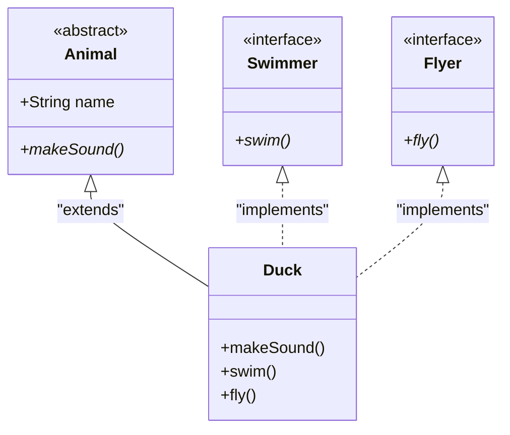

Abstraction is the process of hiding the complex implementation details and showing only the essential features of an object. Think of driving a car: you know how to use the steering wheel and pedals (the abstraction), but you don't need to understand the internal combustion engine (the implementation) to drive.

In Java, abstraction is achieved using **Abstract Classes** and **Interfaces**.

## The Abstract Class

An abstract class is a class declared with the `abstract` keyword. It represents a concept that is "incomplete". Because it is incomplete, **the JVM completely forbids you from instantiating it directly using the `new` keyword.**

```java
public abstract class Animal {
    protected String name;
    
    public Animal(String name) {
        this.name = name;
    }

    // Concrete method (has a body)
    public void sleep() {
        System.out.println("Zzz...");
    }

    // Abstract method (no body) - Forces subclasses to implement this!
    public abstract void makeSound();
}
```

If you try to do `Animal a = new Animal("Bob");`, the compiler will reject it. 

### The Memory Secret of Abstract Classes
Wait a minute. If you can't instantiate an abstract class, why does `Animal` have a constructor? 

Because of **Constructor Chaining**! When you instantiate a concrete subclass (like `Dog extends Animal`), the JVM *must* allocate memory for the `Animal` fields inside the `Dog` object, and the `Dog` constructor *must* implicitly call `super()` to trigger the `Animal` constructor. Abstract classes cannot exist independently on the Heap, but they absolutely exist *inside* their concrete children!

## Interfaces: The Ultimate Contract

If an Abstract Class is a "partial blueprint", an Interface is a **strict legal contract**. 

Historically (before Java 8), an interface was 100% abstract. It could not hold any instance state (no variables), and it could not provide any implementation (no method bodies).

```java
public interface Swimmable {
    // Implicitly public static final!
    int MAX_DEPTH_METERS = 100; 

    // Implicitly public abstract!
    void swim(); 
}
```

### Marker Interfaces & JVM Intrinsics
A **Marker Interface** is an interface with *zero* methods (e.g., `java.io.Serializable`, `java.lang.Cloneable`). Because it has no methods, it doesn't define a behavior contract. Instead, it acts as a "tag" for the JVM. During runtime, the JVM uses internal `instanceof` checks to see if an object is tagged with a marker interface, and if so, it enables special intrinsic JVM behaviors (like allowing the object to be written to a byte stream).

### Solving the Diamond Problem (Multiple Inheritance)

In the Inheritance module, we learned that Java explicitly forbids a class from `extend`ing multiple parent classes to avoid the Diamond Problem (which method should I inherit if both parents have it?).

However, Java *does* allow a class to `implement` multiple interfaces! This is called **Multiple Inheritance of Types**.



```java
public class Duck extends Animal implements Swimmer, Flyer {
    public Duck() { super("Duck"); }

    @Override
    public void makeSound() { System.out.println("Quack!"); }

    @Override
    public void swim() { System.out.println("Paddling in water..."); }

    @Override
    public void fly() { System.out.println("Flapping wings!"); }
}
```

Because interfaces traditionally had no method bodies, there was no Diamond Problem! If two interfaces both defined `void move();`, the `Duck` class just provides *one* implementation, satisfying both contracts simultaneously.

## The Modern Interface (Java 8+)

In Java 8, a massive problem arose. The architects wanted to add a `stream()` method to the `Collection` interface. But if they added a new abstract method to a core interface, it would instantly break millions of existing Java applications worldwide (because every custom collection class would suddenly fail to compile until they implemented the new method).

To solve this, Java 8 introduced **Default Methods**.

### `default` Methods
You can now provide a concrete implementation directly inside an interface using the `default` keyword. This allows you to evolve interfaces without breaking backwards compatibility.

```java
public interface Vehicle {
    void start(); // Abstract

    // Concrete implementation!
    default void soundHorn() {
        System.out.println("Beep!");
    }
}
```

**Wait... didn't this bring back the Diamond Problem?**
Yes! If a class implements two interfaces that both have the exact same `default` method, the compiler will panic and throw an error. You must manually override the method in the child class to resolve the conflict.

```java
public class HybridCar implements GasVehicle, ElectricVehicle {
    @Override
    public void start() {
        // You MUST explicitly choose which default method to inherit
        // using the special Interface.super.method() syntax!
        ElectricVehicle.super.start(); 
    }
}
```

### `static` and `private` Methods
- **Java 8** also added `static` methods to interfaces (great for utility methods, e.g., `Comparator.naturalOrder()`).
- **Java 9** added `private` methods. This allows you to write private helper methods inside an interface to share logic between multiple `default` methods without exposing the helper to the outside world.

### Functional Interfaces and The Lambda Bridge
An interface that contains **exactly one abstract method** is called a **Functional Interface**. You should always tag them with the `@FunctionalInterface` annotation. 
Because they only have a single unimplemented method, Java allows you to instantiate them on the fly using **Lambdas**. (We will dive deep into this in Level 4: The Functional Java Dev).

### Sealed Interfaces (Java 15+)
Historically, anyone could implement your public interface. What if you wanted to define a strict mathematical concept, like a `Shape`, and absolutely guarantee that the *only* valid implementations in the entire universe are `Circle`, `Square`, and `Triangle`?

Java 15 introduced **Sealed Classes and Interfaces** to solve this. Using the `sealed` and `permits` keywords, you can explicitly restrict which classes are allowed to implement your interface.

```java
// NO OTHER CLASS IS ALLOWED TO IMPLEMENT THIS!
public sealed interface Shape permits Circle, Square, Triangle {
    double calculateArea();
}
```

## Abstract Class vs Interface: The Golden Rule

How do you know which one to use?

1. **Use an Abstract Class** when you are defining an **"is-a"** relationship that requires sharing **state** (instance variables) or complex constructor initialization between closely related classes.
2. **Use an Interface** when you are defining a **"can-do"** capability (a behavior) that can be applied to completely unrelated classes. (A `Duck`, a `Submarine`, and a `Penguin` are entirely unrelated objects, but they can all implement `Swimmable`).

---

## 🎯 Interview Questions

**1. Can an Abstract Class be instantiated?**
> *Answer:* No, not directly via the `new` keyword. However, its constructor is always executed via constructor chaining (`super()`) when a concrete subclass is instantiated.

**2. Can an Interface have state (variables)?**
> *Answer:* No. Any variable defined in an interface is implicitly `public static final` (a constant). Interfaces cannot hold instance state.

**3. What happens if a class implements two interfaces with the exact same `default` method?**
> *Answer:* The compiler throws a Multiple Inheritance conflict error. To resolve it, the implementing class *must* override the conflicting method and provide its own implementation (or explicitly call one of the interface's default methods using `InterfaceName.super.methodName()`).

**4. Why did Java 8 introduce `default` methods?**
> *Answer:* To enable backward compatibility. It allowed the Java designers to add new methods (like `.stream()`) to existing core interfaces (like `Collection`) without breaking legacy code that had already implemented those interfaces.
