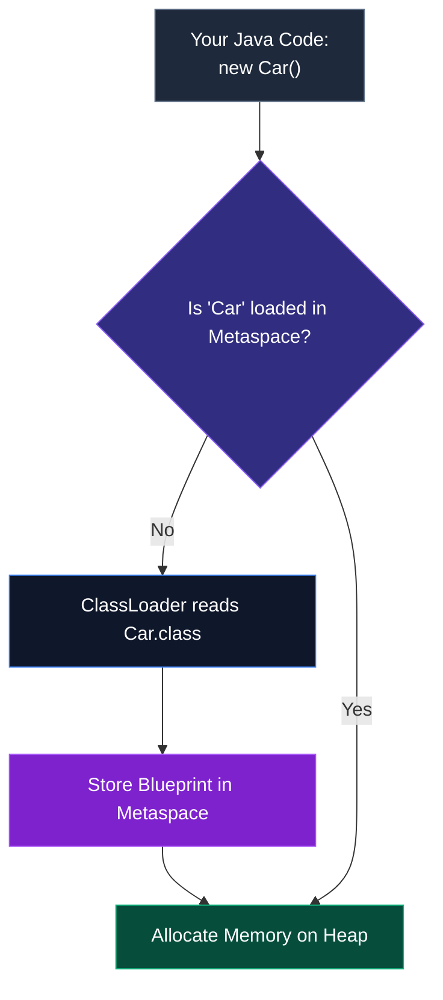

In Level 0, we introduced the basic concept of a Class acting as a blueprint for Objects on the Heap. Now, we must elevate that understanding. To write enterprise-grade Java, you must understand exactly how classes are loaded, the nuances of constructors, and the critical distinction between instance state and class state.

## 1. The ClassLoader and The Metaspace

Before you can instantiate an Object, the JVM must first load the Class blueprint into memory. This is done by the **ClassLoader** subsystem.

When you reference a class for the very first time (e.g., by calling `new Car()`), the ClassLoader reads the `.class` bytecode and loads the class metadata into a special region of memory called the **Metaspace** (formerly known as PermGen).



The Metaspace holds the structural definition: method signatures, field definitions, and—crucially—**Static Variables**.

## 2. Instance vs. Class (Static) Variables

This is a fundamental concept that trips up many beginners.

### Instance Variables (The Object's State)
Fields declared normally belong to the **Instance**. If you create 1,000 Objects, you get 1,000 separate copies of those variables stored on the Heap.

### Static Variables (The Class's State)
If you add the `static` keyword, the variable belongs to the **Class** itself, living in the Metaspace. There is only **one copy** of a static variable, no matter how many objects you instantiate. All instances share it.

```java
public class BankAccount {
    
    // Instance Variable (Unique to each account)
    double balance;
    
    // Static Variable (Shared across ALL accounts)
    static double globalInterestRate = 0.05;

    public BankAccount(double initialBalance) {
        this.balance = initialBalance;
    }
}
```

```java
BankAccount alice = new BankAccount(1000);
BankAccount bob = new BankAccount(500);

// Changing the static variable changes it for EVERYONE
BankAccount.globalInterestRate = 0.07; 
```

> [!CAUTION]
> Avoid modifying `static` variables dynamically unless absolutely necessary. Shared mutable state across multiple objects (and potentially multiple threads) is the root cause of many elusive bugs in Java.

## 3. Advanced Constructors

A **Constructor** initializes the object's instance variables. But what if you don't provide one? What if you want multiple ways to create an object?

### The Default (No-Args) Constructor
If you write a class without *any* constructor, the Java Compiler silently inserts a hidden, empty, no-arguments constructor for you. 

```java
public class User {
    String username;
    // The compiler inserts: public User() {}
}
// Valid: User u = new User();
```

> [!WARNING]
> The moment you define *any* constructor (e.g., `public User(String name)`), the compiler **revokes** the free default constructor. If you still want to be able to create an empty `new User()`, you must explicitly write `public User() {}`.

### Constructor Overloading
You can define multiple constructors with different parameters. This provides flexibility for the developers using your class.

```java
public class Server {
    String host;
    int port;

    // Constructor 1: Fully parameterized
    public Server(String host, int port) {
        this.host = host;
        this.port = port;
    }

    // Constructor 2: Defaults to port 80
    public Server(String host) {
        this.host = host;
        this.port = 80;
    }

    // Constructor 3: Complete defaults
    public Server() {
        this.host = "localhost";
        this.port = 8080;
    }
}
```

### Constructor Chaining (`this()`)
To avoid duplicating code in overloaded constructors, you can call one constructor from another using `this()`. **It must be the very first line of the constructor.**

```java
public class Server {
    String host;
    int port;

    public Server(String host, int port) {
        this.host = host;
        this.port = port;
    }

    public Server(String host) {
        // Calls the primary constructor above!
        this(host, 80); 
    }
}
```

## 4. Method Overloading

Just as you can overload constructors, Java allows you to overload standard methods. You can define multiple methods with the *exact same name* inside the same Class, as long as their parameter lists are different (different number of parameters, or different types).

```java
public class Logger {
    public void log(String message) {
        System.out.println("INFO: " + message);
    }

    // Overloaded! Same name, different parameters.
    public void log(String message, String level) {
        System.out.println(level.toUpperCase() + ": " + message);
    }
    
    // Overloaded! Different parameter type.
    public void log(Exception e) {
        System.err.println("ERROR: " + e.getMessage());
    }
}
```
The Java compiler uses **Static (Compile-Time) Polymorphism** to bind the method call to the correct implementation based on the arguments provided.

## 5. The Deep Mechanics of `this`

As discussed in Level 0, `this` refers to the current executing object. But it has two distinct uses:

1. **Disambiguation**: Resolving shadowing when a parameter name matches a field name (`this.name = name;`).
2. **Method Chaining**: Returning the current instance from a method to allow chained calls. This is the foundation of the **Builder Pattern**.

```java
public class QueryBuilder {
    private String table;
    private String condition;

    public QueryBuilder selectFrom(String table) {
        this.table = table;
        return this; // Return the current object!
    }

    public QueryBuilder where(String condition) {
        this.condition = condition;
        return this; // Return the current object!
    }

    public String build() {
        return "SELECT * FROM " + this.table + " WHERE " + this.condition;
    }
}

// Usage (Method Chaining):
String sql = new QueryBuilder()
                .selectFrom("Users")
                .where("age > 18")
                .build();
```

---

## 🎯 Interview Questions

**What is the difference between an Instance variable and a Static variable?**
> *Answer:* Instance variables are unique to each object and are stored on the Heap. Static variables belong to the class itself, are stored in the Metaspace, and are shared by all instances of the class.

**If you define a custom parameterized constructor, will the compiler still generate a default no-args constructor?**
> *Answer:* No. The compiler only generates the default no-args constructor if the class has absolutely no explicit constructors defined.

**What is constructor chaining and how is it achieved in Java?**
> *Answer:* Constructor chaining is the process of calling one constructor from another within the same class. It is achieved using the `this()` keyword, which must be the very first statement inside the constructor.

**What is Method Overloading and what type of polymorphism does it represent?**
> *Answer:* Method Overloading allows a class to have multiple methods with the same name, provided their parameter lists differ. It represents **Compile-Time (Static) Polymorphism** because the compiler determines which method to execute at compile time based on the arguments.
