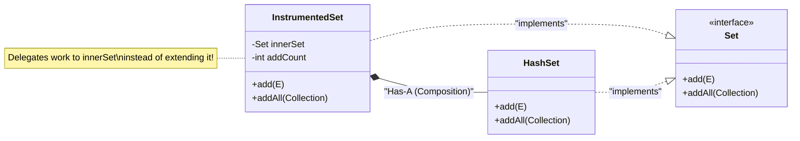

When Object-Oriented Programming first exploded in popularity in the 1990s, developers went crazy with **Inheritance**. Everything extended everything else. 

Three decades later, the software engineering industry reached a massive consensus: **Inheritance is the tightest form of coupling available in Java, and it should be avoided whenever possible.**

Instead, the modern mantra is: **Favor Composition over Inheritance.**

## "Is-A" vs "Has-A"

- **Inheritance** defines an **"Is-A"** relationship. (A `Car` *is a* `Vehicle`).
- **Composition** defines a **"Has-A"** relationship. (A `Car` *has an* `Engine`).

Composition simply means including an instance of another class as a field inside your class, rather than inheriting from it.

```java
// INHERITANCE (Tight Coupling)
public class ElectricCar extends Engine {
    // A Car is NOT an Engine. This is terrible design!
}

// COMPOSITION (Loose Coupling)
public class ElectricCar {
    // A Car HAS an Engine. This is excellent design!
    private Engine engine; 
    
    public ElectricCar(Engine engine) {
        this.engine = engine;
    }
}
```

By passing the `Engine` into the constructor (a concept called **Dependency Injection**), we can easily swap out a Gas engine for an Electric engine without changing the `Car` class at all! 

### Compile-Time vs Run-Time Flexibility (Strategy Pattern)
Inheritance locks behavior at **compile-time**. If a `Character` *is a* `Swordsman`, they can never become a `Bowman`. 
Composition allows you to swap behavior at **run-time**. If a `Character` *has a* `Weapon`, you can easily write `character.setWeapon(new Bow())` mid-game! This is the core of the famous **Strategy Design Pattern**.

## The Banana, Monkey, Jungle Problem

Why is inheritance so dangerous? Erlang creator Joe Armstrong famously summarized the problem with OOP inheritance:

> *"The problem with object-oriented languages is they've got all this implicit environment that they carry around with them. You wanted a banana but what you got was a gorilla holding the banana and the entire jungle."*

When you inherit from a class, you inherit *everything*. If `class A` extends `class B` extends `class C`, and you just want to use a tiny helper method in `C`, you are forced to drag the entire massive state and memory overhead of `A` and `B` into your new class.

### Deep Inheritance Hierarchies
Deep hierarchies (more than 2 or 3 levels deep) become impossible to maintain. 
If a developer changes a single variable in the top-level parent class, it cascades down and can instantly break 50 different subclasses across the entire application.

### The Liskov Substitution Principle (LSP) Trap
Inheritance often tricks developers into violating SOLID principles. The classic example is `Square extends Rectangle`. Mathematically, a square *is a* rectangle. But in code, if a `Rectangle` has `setWidth()` and `setHeight()`, a `Square` subclass must override `setWidth()` to *also* change the height (to remain a square). 

If a method expects a `Rectangle` and receives your `Square`, it might call `rect.setWidth(5)` and `rect.setHeight(10)`, expecting an area of 50. But your `Square` intercepts this, forces both sides to 10, and returns an area of 100. The application crashes. **Composition avoids this entirely.**

## The Fragile Base Class Problem

The most devastating side effect of inheritance is the **Fragile Base Class Problem**. 

Because a child class relies on the internal implementation details of its parent, a seemingly innocent update to the parent class can destroy the child class—even if the parent's method signatures didn't change!

Let's look at a classic example using an `InstrumentedHashSet` (a Set that tracks how many total items have been added to it over its lifetime).

```java
public class InstrumentedHashSet<E> extends HashSet<E> {
    private int addCount = 0;

    @Override
    public boolean add(E e) {
        addCount++; // Track the addition
        return super.add(e); // Call the parent
    }

    @Override
    public boolean addAll(Collection<? extends E> c) {
        addCount += c.size(); // Track the bulk addition
        return super.addAll(c); // Call the parent
    }
    
    public int getAddCount() { return addCount; }
}
```

This looks perfectly fine. But let's test it:

```java
InstrumentedHashSet<String> s = new InstrumentedHashSet<>();
s.addAll(List.of("Snap", "Crackle", "Pop"));
System.out.println(s.getAddCount()); 
```

**Output:** `6` (Wait, what? We only added 3 items!)

**Why did this happen?**
Under the hood, Java's `HashSet.addAll()` method is implemented by calling its own `add()` method in a loop. 
1. Our `addAll` adds 3 to `addCount`. (Count is 3).
2. We call `super.addAll()`.
3. The parent `HashSet` loops 3 times, calling `add()`. 
4. Because `add()` is **overridden** in our child class, Dynamic Polymorphism routes those calls *back down* into our child's `add()` method!
5. Our child's `add()` method increments `addCount` 3 more times. (Count is 6).

The child class is fundamentally broken because it relied on the *internal, undocumented implementation details* of the parent class. If the Java engineers ever change how `HashSet` works internally, our class breaks. **This is the Fragile Base Class Problem.**

## The Solution: Composition + Interfaces

Instead of inheriting, we use Composition and Interfaces (specifically, the **Decorator Pattern**).

We hold a `private` reference to a `Set`, and we "forward" or "delegate" all method calls to it.



```java
// We implement the interface, NOT the concrete class!
public class InstrumentedSet<E> implements Set<E> {
    
    // COMPOSITION! We "Has-A" Set.
    private final Set<E> innerSet; 
    private int addCount = 0;

    // We inject the Set via the constructor
    public InstrumentedSet(Set<E> innerSet) {
        this.innerSet = innerSet;
    }

    @Override
    public boolean add(E e) {
        addCount++;
        // Delegate the actual work to the composed object!
        return innerSet.add(e); 
    }

    @Override
    public boolean addAll(Collection<? extends E> c) {
        addCount += c.size();
        // Delegate the actual work to the composed object!
        return innerSet.addAll(c); 
    }
    
    // ... all other Set methods just return innerSet.methodName()
}
```

Now, `InstrumentedSet` is completely immune to the Fragile Base Class problem. It doesn't care how `innerSet` implements `addAll()`; it just increments the counter and passes the data along!

## The Performance Trade-Off (Pointer Chasing)
Is Composition strictly better? Architecturally, yes. But a "Java God" knows there is a hardware-level trade-off.

When you use Inheritance, the JVM allocates the parent's fields and the child's fields in a **single, contiguous block of memory** on the Heap. The CPU can cache this block very efficiently.
When you use Composition, your object holds a *reference* (a memory address) to another object elsewhere on the Heap. To execute a delegated method, the CPU must jump from the first object's memory address to the second object's memory address. This is called **Pointer Chasing** and it can cause **CPU Cache Misses**, which are microscopically slower. However, in 99.9% of enterprise applications, the massive architectural benefits of Composition heavily outweigh this micro-optimization!

---

## 🎯 Interview Questions

**1. What does "Favor Composition over Inheritance" mean?**
> *Answer:* It is a design principle stating that code reuse should be achieved by assembling objects containing other objects (Composition, "Has-A") rather than building deep hierarchies of classes inheriting from one another (Inheritance, "Is-A").

**2. What is the Fragile Base Class problem?**
> *Answer:* It occurs when a superclass is modified in a seemingly safe way, but because subclasses rely heavily on the parent's internal implementation details (due to the tight coupling of inheritance), the subclasses experience unexpected side-effects and break.

**3. If inheritance is so dangerous, when should I actually use `extends`?**
> *Answer:* You should only use inheritance when a strict, unmistakable "Is-A" relationship exists, and both classes are in the same package and controlled by the same developer. If you are extending a class from a third-party library or standard API (like `HashSet`), you should almost always use Composition instead.
