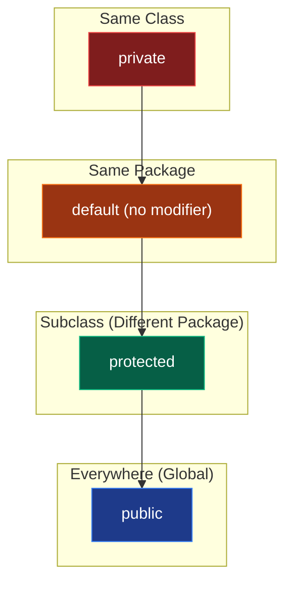

In Level 1's previous module, we learned how to properly instantiate objects and construct memory models. Now, we confront the most critical pillar of Object-Oriented Programming (OOP): **Encapsulation**.

Without encapsulation, an object is just a loose bag of data. Any other class can reach in, mutate its internal state, and break its logical integrity. Encapsulation is the defensive shield that prevents this chaos.

## 1. Access Modifiers: The Gatekeepers

Java provides four distinct access modifiers that dictate precisely who can see (and modify) your classes, methods, and variables. 

### Visibility Architecture



Here is the exact matrix of visibility. Memorize this table; it is essential for both system design and technical interviews.

| Modifier | Same Class | Same Package | Subclass (Diff Package) | Everywhere |
| :--- | :---: | :---: | :---: | :---: |
| `private` | ✅ | ❌ | ❌ | ❌ |
| `default` | ✅ | ✅ | ❌ | ❌ |
| `protected`| ✅ | ✅ | ✅ | ❌ |
| `public` | ✅ | ✅ | ✅ | ✅ |

> [!IMPORTANT]  
> The "default" access modifier (also known as package-private) is what you get when you don't explicitly write a modifier. It restricts access strictly to classes within the exact same package.

## 2. Information Hiding

At its core, Encapsulation is about **Information Hiding**. 

Imagine a `BankAccount` object. If the `balance` field is `public`, any other class can maliciously or accidentally set `balance = -999999;`. The `BankAccount` class loses all control over its own state.

By marking `balance` as `private`, we hide the internal representation from the outside world.

```java
public class BankAccount {
    // Hidden from the outside world
    private double balance;

    public BankAccount(double initialBalance) {
        if (initialBalance >= 0) {
            this.balance = initialBalance;
        } else {
            this.balance = 0;
        }
    }
}
```

## 3. Getters and Setters: Controlled Access

If `balance` is private, how do users interact with it? We provide public **Getters** (Accessors) and **Setters** (Mutators). 

This isn't just boilerplate; it creates a strict contract. A setter allows the class to validate the incoming data before accepting it.

```java
public class BankAccount {
    private double balance;

    // Getter: Safe read-only access
    public double getBalance() {
        return this.balance;
    }

    // Setter: Controlled mutation with validation logic
    public void deposit(double amount) {
        if (amount > 0) {
            this.balance += amount;
        } else {
            throw new IllegalArgumentException("Deposit amount must be positive.");
        }
    }
    
    // Notice there is no setBalance() or withdraw() 
    // that allows an arbitrary negative balance!
}
```

## 4. Immutability: The Ultimate Encapsulation

What if an object's state should *never* change after it is created? This is called **Immutability**. Immutable objects are inherently thread-safe, infinitely cacheable, and prevent an entire category of side-effect bugs.

To create an immutable class, you must adhere to these rigorous rules:
1. **Declare the class as `final`**: This prevents child classes from overriding methods and bypassing encapsulation.
2. **Mark all fields as `private` and `final`**: Fields are hidden and can only be assigned once during construction.
3. **Do NOT provide any Setters**: There should be no methods that modify the state.
4. **Deep Copy on Initialization (Defensive Copying)**: If the class holds mutable objects (like arrays or `Date` objects), initialize them with a deep copy to prevent external mutation.
5. **Deep Copy on Access**: When returning mutable fields in Getters, return a clone or copy, never the direct reference.

Here is a robust example demonstrating defensive copying:

```java
import java.util.Date;

public final class ImmutableUser {
    private final String username; // String is already immutable
    private final Date registrationDate; // Date is MUTABLE!

    public ImmutableUser(String username, Date registrationDate) {
        this.username = username;
        // DEFENSIVE COPY: Do not assign the reference directly
        this.registrationDate = new Date(registrationDate.getTime());
    }

    public String getUsername() { 
        return username; 
    }

    public Date getRegistrationDate() { 
        // DEFENSIVE COPY: Return a clone to prevent external modification
        return new Date(registrationDate.getTime()); 
    }
}
```

> [!TIP]
> Strings in Java are fully immutable. This is why when you append to a String, a completely new String object is created in memory, leaving the original perfectly intact. Modern Java also introduced `java.time.Instant` and `LocalDate` which are immutable, replacing the legacy, mutable `Date` class.

## 5. Why Encapsulation is the Cornerstone of Architecture

When building large-scale enterprise applications, code will constantly change. If your system lacks encapsulation, a change in one class's internal logic will cascade and break 50 other classes that directly accessed its internal fields.

Encapsulation decouples the **Implementation** from the **API Contract**:
- **Implementation**: The private fields and helper methods inside the class. You can change these anytime without breaking external code.
- **API Contract**: The public methods (like getters/setters). As long as you maintain the public method signatures, the rest of the application remains ignorant of your internal refactoring.

By strictly enforcing encapsulation, you minimize the blast radius of changes, creating codebases that can scale to millions of lines without collapsing into spaghetti.

---

## 🎯 Advanced Interview Questions

**1. What happens if you do not specify an access modifier for a class or variable?**
> *Answer:* It defaults to package-private ("default" modifier). This means it is only accessible to other classes residing in the exact same package.

**2. Can a top-level class be marked as `private` or `protected`?**
> *Answer:* No. Top-level classes can only be `public` or package-private (default). Only nested/inner classes can be marked `private` or `protected`.

**3. Why is Encapsulation sometimes referred to as Data Hiding?**
> *Answer:* Because it restricts direct access to an object's internal data (fields) from outside the class. The class hides its internal state and exposes only safe, validated operations through its public methods.

**4. How do you create a truly immutable class in Java if it contains a mutable field like a `List` or a `Date`?**
> *Answer:* You must use Defensive Copying. When initializing the object in the constructor, you must create a deep copy of the mutable object. Similarly, when returning the mutable field via a getter, you must return a deep copy (or an unmodifiable view like `Collections.unmodifiableList()`) rather than the original reference.

**5. What is the difference between Encapsulation and Abstraction?**
> *Answer:* Encapsulation is about **Information Hiding**—bundling data and methods together and hiding the internal state to protect it from unauthorized modification. Abstraction is about **Implementation Hiding**—exposing only essential features of an object (what it does) while hiding the complex background details (how it works), often achieved via Interfaces or Abstract classes.
