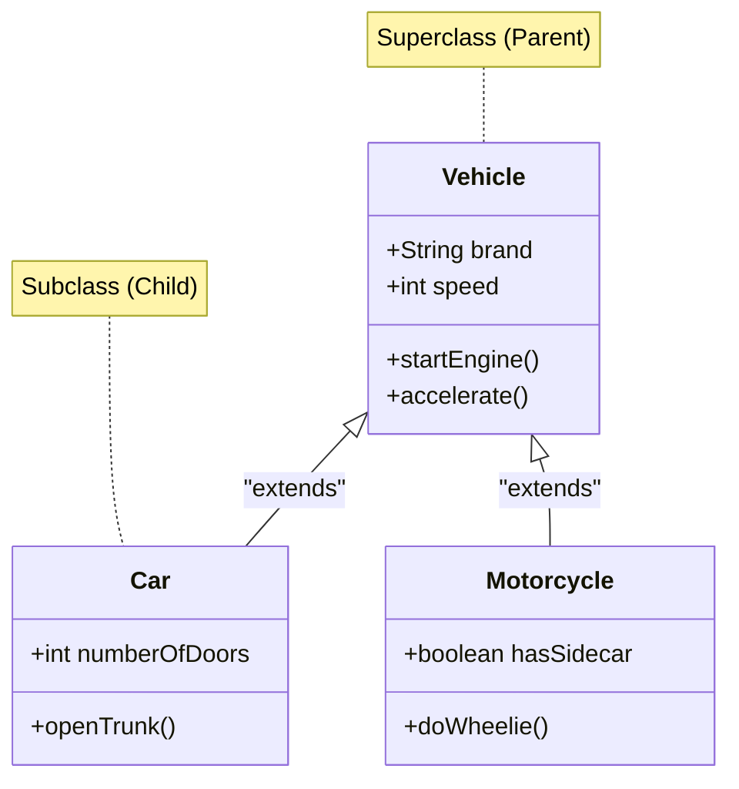

Inheritance is one of the four fundamental pillars of Object-Oriented Programming (OOP). It allows a new class (the **subclass** or **child class**) to inherit fields and methods from an existing class (the **superclass** or **parent class**).

Inheritance defines an strict **"is-a"** relationship. A `Car` *is a* `Vehicle`. A `Manager` *is an* `Employee`. If the "is-a" statement sounds illogical (e.g., A `Car` *is an* `Engine`), you should use **Composition** instead of Inheritance.

## The Class Hierarchy Diagram

Let's visualize a standard inheritance hierarchy using UML standard representation.



In Java, this relationship is established using the `extends` keyword.

```java
// The Superclass
public class Vehicle {
    protected String brand = "Generic";
    
    public void startEngine() {
        System.out.println("Engine started.");
    }
}

// The Subclass
public class Car extends Vehicle {
    int numberOfDoors = 4;
    
    public void openTrunk() {
        System.out.println("Trunk opened.");
    }
}
```

Because `Car` extends `Vehicle`, a `Car` object has full access to `brand` and `startEngine()` without having to write that code again!

## What Exactly is Inherited? (The Private Field Trap)

One of the most common misunderstandings in Java is how inheritance handles `private` fields. 

When `Car` extends `Vehicle`, the JVM allocates memory for the *entire* `Vehicle` state inside the new `Car` object. However, **memory allocation is not the same as access rights.**

Here is the strict inheritance rulebook:
- **`public`**: Inherited. Fully accessible everywhere.
- **`protected`**: Inherited. Accessible to the subclass, even if the subclass is in a different package.
- **Package-Private (Default)**: Inherited *only* if the subclass is in the exact same package as the superclass.
- **`private`**: **Not directly accessible**. The data exists inside the child object in memory, but the child class cannot see or touch it directly.

```java
public class Vehicle {
    public String brand = "Toyota";
    protected int speed = 100;
    private String engineSerialNumber = "XYZ123"; // Hidden from subclasses
    
    // The only way subclasses can interact with the private state
    public String getEngineSerialNumber() {
        return engineSerialNumber;
    }
}

public class Car extends Vehicle {
    public void displayDetails() {
        System.out.println(this.brand); // OK
        System.out.println(this.speed); // OK
        
        // COMPILE ERROR: engineSerialNumber has private access in Vehicle
        // System.out.println(this.engineSerialNumber); 
        
        // Correct approach: Use the inherited public getter
        System.out.println(this.getEngineSerialNumber()); 
    }
}
```

> [!CAUTION]
> A subclass object *contains* the private fields of its parent (they take up physical space on the Heap alongside the child's fields), but it does not *inherit access* to them. You must use `protected` fields or provide `public` getters/setters in the parent class to interact with that hidden state.

## The `super` Keyword and Constructor Chaining

When you instantiate a subclass, the JVM must *first* build the superclass before it can build the subclass. You cannot build the roof of a house without first laying the foundation.

This is handled by the `super()` keyword, which calls the constructor of the parent class.

> [!IMPORTANT]
> If you do not explicitly write `super()`, the Java compiler will secretly insert `super()` as the very first line of your subclass constructor to call the parent's default constructor.

```java
public class Animal {
    String name;
    
    // Parameterized Parent Constructor
    public Animal(String name) {
        this.name = name;
        System.out.println("Animal created: " + this.name);
    }
}

public class Dog extends Animal {
    String breed;
    
    public Dog(String name, String breed) {
        // MUST be the absolute first line!
        super(name); 
        this.breed = breed;
        System.out.println("Dog created: " + this.breed);
    }
}
```

## Method Overriding (`@Override`)

What happens if the parent class has a behavior, but the child class needs to perform that behavior *differently*? You **override** the method.

Method overriding requires the exact same method signature (name and parameters). You should always use the `@Override` annotation. It tells the compiler to double-check that you are actually overriding something, preventing spelling mistakes.

```java
public class Vehicle {
    public void honk() {
        System.out.println("Beep beep!");
    }
}

public class Truck extends Vehicle {
    @Override
    public void honk() {
        System.out.println("HOOOOOONK!");
    }
}
```

### Overriding vs. Overloading
These sound similar but are vastly different concepts:
- **Overriding:** Same method name, same parameters, different class (Child replaces Parent's behavior). Resolved at **Runtime** (Dynamic Polymorphism).
- **Overloading:** Same method name, *different* parameters, same class. Resolved at **Compile-time** (Static Polymorphism).

## Single Inheritance Limitation

Java strictly enforces **Single Inheritance of State**. A class can only `extend` exactly *one* parent class. 

```java
// ERROR! A class cannot have two parents.
public class FlyingCar extends Car, Airplane { } 
```

Why? To avoid the infamous **"Diamond Problem"**. If `Car` and `Airplane` both had a `start()` method, the JVM wouldn't know which one `FlyingCar` should inherit. Java prevents this entirely by forbidding multiple class inheritance. (You can, however, implement multiple *Interfaces*, which we will cover in the Abstraction module).

## The Cosmic Superclass: `java.lang.Object`

In Java, every single class implicitly inherits from `java.lang.Object`. If you write `public class Person {}`, the compiler secretly translates it to `public class Person extends Object {}`.

Because of this, every object you ever create gets a few built-in methods for free:
- `toString()`: Returns a string representation of the object.
- `equals(Object obj)`: Compares memory addresses (can be overridden to compare data).
- `hashCode()`: Returns a memory-based integer (crucial for HashMaps).
- `getClass()`: Returns the Reflection class object.

---

## 🎯 Interview Questions

**1. What is the difference between `this` and `super`?**
> *Answer:* `this` is a reference to the current instance of the class and is used to access its fields and methods. `super` is used to access the parent class's constructors, methods, or fields. `this()` calls another constructor in the *same* class, while `super()` calls the constructor in the *parent* class.

**2. Can you override a `static` method?**
> *Answer:* No. Static methods belong to the Class, not the instance. If a child class defines a static method with the same signature as a parent's static method, it is called **Method Hiding**, not Method Overriding. Dynamic polymorphic dispatch does not apply to static methods.

**3. Why doesn't Java support multiple inheritance?**
> *Answer:* To prevent ambiguity, primarily the "Diamond Problem". If a class inherited from two parents that both defined the exact same method, the JVM would not know which parent's logic to execute.

**4. What is constructor chaining?**
> *Answer:* Constructor chaining is the sequence of constructors called when an object is initialized. Because of the implicit `super()` call, instantiating a child class forces the parent class constructor to run first, creating a chain reaction all the way up to the `Object` class constructor.
