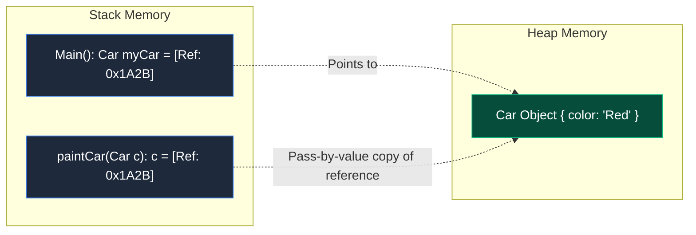

Before mastering Encapsulation and Data Hiding, you must fundamentally understand how Java passes objects around in memory. A failure to understand the difference between a **Reference**, a **Shallow Copy**, and a **Deep Copy** is the root cause of countless enterprise bugs.

## 1. The Great "Pass-By-Value" Debate

A common interview question is: *"Is Java pass-by-value or pass-by-reference?"*
The definitive answer is: **Java is strictly Pass-by-Value.** 

However, this confuses many developers because when you pass an Object to a method, modifying that object inside the method *does* affect the original object. How is this possible if Java is pass-by-value?

Because Java does not pass the object itself. It passes **the value of the reference** (the memory address) to the object.



When you pass `myCar`, Java makes a copy of the "remote control" (the reference) and gives it to the method. Both remote controls point to the exact same TV (the object on the Heap).

## 2. The Assignment Trap (`=`)

In Java, using the assignment operator on object references **does not duplicate the object**. It only duplicates the reference.

```java
User u1 = new User("Alice");
User u2 = u1; // u2 now points to the SAME object in memory!

u2.setName("Bob");
System.out.println(u1.getName()); // Prints "Bob"!
```

If you actually want a second, independent `User` object, you must **Copy** it.

## 3. Shallow Copy

A **Shallow Copy** creates a new object in the Heap, but it does NOT create copies of the nested objects inside it. Instead, it copies the *references* of the nested objects.

```java
public class Department {
    String name;
    Manager manager; // A nested object!
}
```

If you shallow copy a `Department`, you get a new `Department` object, but both the old and new departments will point to the **exact same Manager object**. If one department fires the manager, the other department loses their manager too!

### How to Shallow Copy: `Object.clone()`
Java provides the `Cloneable` marker interface and the `clone()` method for shallow copying.

```java
public class Department implements Cloneable {
    String name;
    Manager manager;

    @Override
    protected Object clone() throws CloneNotSupportedException {
        // This performs a native Shallow Copy
        return super.clone(); 
    }
}
```

> [!WARNING]
> Joshua Bloch (architect of the Java Collections Framework) famously stated that `Cloneable` is broken. It is a legacy interface with many subtle flaws. Modern Java strongly discourages `clone()`.

## 4. Deep Copy

A **Deep Copy** creates a new object *and* recursively creates new copies of all nested objects. The new object is 100% independent of the original.

There are three primary ways to achieve a Deep Copy in modern Java:

### 1. The Copy Constructor (Recommended)
This is the safest and most explicit way. You write a constructor that takes an instance of its own class and manually copies the fields.

```java
public class Manager {
    String name;
    public Manager(Manager other) {
        this.name = other.name; // Strings are immutable, so safe to share
    }
}

public class Department {
    String name;
    Manager manager;

    // Copy Constructor
    public Department(Department other) {
        this.name = other.name;
        // DEEP COPY: Create a brand new Manager object!
        this.manager = new Manager(other.manager); 
    }
}
```

### 2. JSON Serialization (The Hacky Way)
You can convert the object to a JSON string (using Jackson or Gson), and then parse the JSON back into a new Object. This is easy to write but significantly slower at runtime.

### 3. Java Serialization (Legacy)
By implementing `Serializable`, you can write the object to a `ByteArrayOutputStream` and read it back. This is notorious for security vulnerabilities and terrible performance.

## 5. Bridging to Encapsulation

Why did we learn this *now*?

Because in the next topic, **Encapsulation**, we will learn how to protect our objects. If a getter returns a mutable reference directly (a shallow copy), malicious code can modify your object's internal state. Understanding how to execute a **Deep Copy** is a strict prerequisite for writing secure, encapsulated Java APIs.

---

## 🎯 Interview Questions

**1. Is Java Pass-by-Value or Pass-by-Reference?**
> *Answer:* Java is strictly pass-by-value. When an object is passed to a method, a copy of the *reference* (the memory address) is passed by value. The method cannot reassign the caller's reference to a new object, but it *can* modify the object the reference points to.

**2. What is the difference between a Shallow Copy and a Deep Copy?**
> *Answer:* A shallow copy creates a new top-level object but copies only the *references* of nested objects (they share the same nested objects). A deep copy recursively duplicates all nested objects, resulting in two completely independent object graphs.

**3. Why is the `Cloneable` interface discouraged?**
> *Answer:* It lacks a `clone()` method natively (it's just a marker interface), it forces you to deal with `CloneNotSupportedException`, it bypasses standard constructors, and it only performs a shallow copy by default, which often leads to subtle bugs. Copy Constructors are highly preferred.
