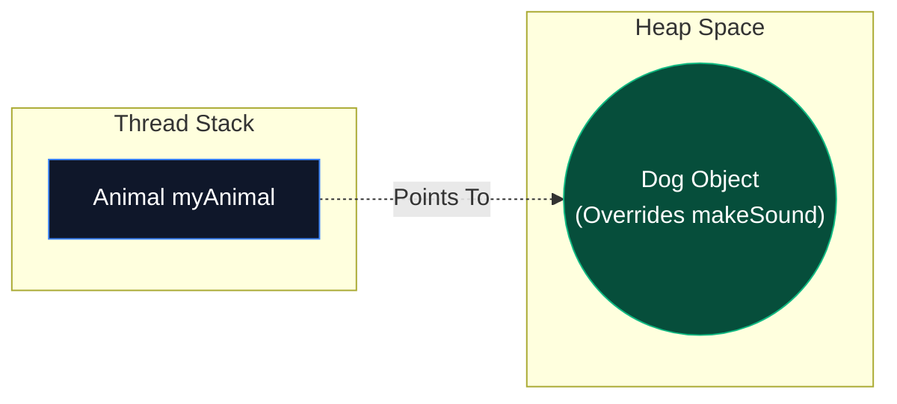

Polymorphism comes from Greek meaning "many forms". In Java, it allows us to perform a single action in different ways. It is the core mechanism that allows our code to be flexible, reusable, and decoupled.

There are two distinct types of Polymorphism in Java: **Compile-Time** and **Run-Time**.

## 1. Compile-Time Polymorphism (Static Binding)

Also known as **Method Overloading**, this occurs when multiple methods in the same class share the exact same name, but have different parameters (different signatures).

```java
public class MathHelper {
    // Overload 1
    public int add(int a, int b) { return a + b; }
    
    // Overload 2
    public double add(double a, double b) { return a + b; }
    
    // Overload 3
    public int add(int a, int b, int c) { return a + b + c; }
}
```

This is called "Static Binding" because the **compiler** decides exactly which method to execute at compile-time. There is no guesswork when the program is actually running. The compiler looks at the arguments you provide (`add(5, 10)` vs `add(5.5, 2.0)`) and wires the call directly to the correct block of memory.

## 2. Run-Time Polymorphism (Dynamic Dispatch)

This is where the true power of Object-Oriented Programming lies. Also known as **Method Overriding**, this occurs when a child class provides a specific implementation for a method already defined in its parent class.

To utilize Run-Time Polymorphism, we use a **Parent Reference to point to a Child Object**.



```java
class Animal {
    public void makeSound() { System.out.println("Generic animal sound"); }
}

class Dog extends Animal {
    @Override
    public void makeSound() { System.out.println("Bark!"); }
}

class Cat extends Animal {
    @Override
    public void makeSound() { System.out.println("Meow!"); }
}

public class Main {
    public static void main(String[] args) {
        // Parent Reference = Child Object
        Animal myPet = new Dog(); 
        
        // Output: "Bark!"
        myPet.makeSound(); 
    }
}
```

### Under the Hood: The `vtable` (Virtual Method Table)
When the compiler sees `myPet.makeSound()`, it only knows that `myPet` is an `Animal`. It has *no idea* what the actual physical object is on the Heap. So how does it know to print "Bark"?

During runtime, the JVM uses a mechanism called **Dynamic Method Dispatch**. Here is exactly what happens in memory:
1. **The Object Header**: Every single object on the Heap has a hidden 12-byte (or 16-byte) "Object Header". Inside this header is a pointer called the **Klass Pointer**.
2. **The Metaspace**: The Klass Pointer points to the actual Class metadata stored in the JVM's **Metaspace** (a native memory region outside the Heap).
3. **The `vtable`**: Inside this Metaspace class data is an array called the `vtable` (Virtual Method Table). It holds memory pointers to the actual executable machine code for every method.
4. **The Lookup**: When you call `myPet.makeSound()`, the CPU follows the object reference to the Heap, reads the Klass Pointer, jumps to the `Dog` class in the Metaspace, looks at the `makeSound` index in the `vtable`, finds the pointer to the overridden byte code, and executes it!

*(Note: When resolving methods from **Interfaces**, the JVM uses a slightly different table called an `itable` (Interface Method Table), which is microscopically slower because it requires an extra offset lookup step due to multiple inheritance of types.)*

### Covariant Return Types
A key rule of overriding (Dynamic Dispatch) is that the child method must have the exact same signature. However, since Java 5, you are allowed to change the return type *only if* the new return type is a subclass of the original return type.

```java
class Animal {
    public Animal giveBirth() { return new Animal(); }
}

class Dog extends Animal {
    @Override
    // This is valid! Dog is a subclass of Animal.
    public Dog giveBirth() { return new Dog(); } 
}
```

## 3. Upcasting and Downcasting

Because of Polymorphism, we are constantly casting objects between parent and child types.

### Upcasting (Implicit & Safe)
Casting a child object to a parent reference. Java does this automatically because a `Dog` **is definitely** an `Animal`.
```java
Dog myDog = new Dog();
Animal a = myDog; // Implicit Upcast. Completely safe!
```

### Downcasting (Explicit & Dangerous)
Casting a parent reference back down to a child reference. The compiler forces you to cast explicitly `(Dog)` because an `Animal` **might not** be a `Dog`.

```java
Animal a = new Dog();

// COMPILER ERROR! The compiler doesn't know 'a' is a Dog.
// Dog d = a; 

// EXPLICIT DOWNCAST. You are promising the compiler it's a Dog.
Dog d = (Dog) a; 
d.fetch(); // Success!
```

### The `ClassCastException` Trap
What happens if you break your promise to the compiler?

```java
Animal a = new Cat();
Dog d = (Dog) a; // The compiler allows this explicitly...
```
When this code runs, the JVM looks at the actual object on the heap, sees a `Cat`, and realizes it cannot be cast to a `Dog`. The JVM immediately throws a fatal **`ClassCastException`** and crashes the program.

## 4. Pattern Matching for `instanceof` (Java 16+)

To prevent `ClassCastException`, developers traditionally used the `instanceof` operator to check the type *before* casting.

**The Old, Ugly Way (Pre-Java 16):**
```java
Animal a = getUnknownAnimal();

if (a instanceof Dog) {
    // Redundant boilerplate! We just proved it's a Dog!
    Dog d = (Dog) a; 
    d.fetch();
}
```

**The Modern Way (Java 16+ Pattern Matching):**
Java 16 introduced pattern matching for `instanceof`. You can now declare a local variable directly inside the `if` statement! If the check passes, the JVM automatically casts the object and assigns it to your new variable.

```java
Animal a = getUnknownAnimal();

// 'd' is automatically created, cast, and scoped to the 'if' block!
if (a instanceof Dog d) {
    d.fetch();
} else if (a instanceof Cat c) {
    c.purr();
}
```

This completely eliminates the need for manual downcasting and results in vastly cleaner, safer code.

---

## 🎯 Interview Questions

**1. What is the difference between Static Binding and Dynamic Binding?**
> *Answer:* Static binding (Compile-time polymorphism) is resolved by the compiler using Method Overloading based on parameter signatures. Dynamic binding (Run-time polymorphism) is resolved by the JVM during execution using Method Overriding and the object's `vtable` to determine the actual object type on the Heap.

**2. Can you override a `private` or `static` method?**
> *Answer:* No. Private methods are not visible to subclasses. Static methods belong to the Class itself, not the instance. If you redefine a static method in a subclass, it is called **Method Hiding**, not Method Overriding. It will be resolved using Static Binding, not Dynamic Dispatch!

**3. What is the `ClassCastException` and how do you prevent it?**
> *Answer:* It is a RuntimeException thrown when you attempt to explicitly downcast an object to a type that it is not (e.g., casting a `Cat` object to a `Dog` reference). It is prevented by using the `instanceof` operator (or modern Java 16+ pattern matching) to verify the object's true type before attempting the downcast.
