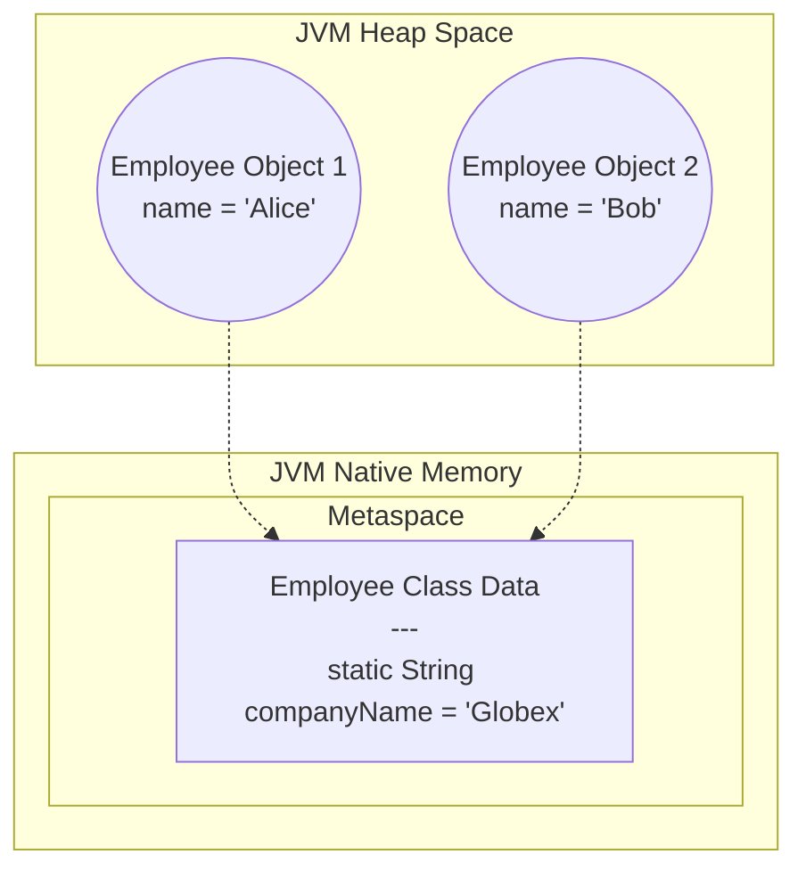

In Object-Oriented Programming, data usually belongs to an *instance* of an object. If you create five `Car` objects, you have five separate `engine` variables on the Heap.

But what if you want a variable to be shared across *all* instances of a class? Or what if you want to call a method without having to instantiate an object at all?

This is where the `static` keyword comes in. In Java, `static` means: **"This belongs to the Class itself, not to any specific instance of the class."**

## 1. Static Variables and JVM Memory

When you declare a variable as `static`, the JVM ensures that only **one single copy** of that variable exists in memory, regardless of whether you create zero objects or a million objects.

```java
public class Employee {
    // Instance Variable (1 per object on the Heap)
    public String name;
    
    // Static Variable (1 total in the entire JVM!)
    public static String companyName = "Globex Corp";
    
    public Employee(String name) {
        this.name = name;
    }
}
```

### Where do Static Variables live?
Before Java 8, static variables lived in a special area of the Heap called the *PermGen* (Permanent Generation). 
Since Java 8, PermGen was removed and replaced by the **Metaspace**. The Metaspace is a native memory region (outside the Heap) where the JVM stores class definitions. Because static variables belong to the class definition, they are stored directly alongside the class metadata!



Because `companyName` is shared, if you change it using `Employee.companyName = "Acme Corp";`, both Alice and Bob will instantly see the new company name!

> [!CAUTION]
> **Thread Safety Trap:** Because a static variable is a global, shared state, mutating it in a multi-threaded environment is highly dangerous and will lead to Race Conditions unless properly synchronized!

> [!WARNING]
> **The Ultimate Memory Leak:** The Garbage Collector cleans up objects on the Heap when they are no longer referenced. However, static variables live in the Metaspace and are tied to the Class itself, meaning they are **never** garbage collected until the Classloader unloads (which usually only happens when the application shuts down). If you maintain a `public static List<Data> cache = new ArrayList<>();` and keep adding to it, your application will eventually crash with an `OutOfMemoryError` because that memory can never be freed!

## 2. Static Methods

A static method is a method that can be invoked without creating an instance of the class.

```java
public class MathUtils {
    // Static Method
    public static int add(int a, int b) {
        return a + b;
    }
}

// Called directly on the Class name!
int result = MathUtils.add(5, 10); 
```

### The Golden Rule of Static Methods
**A static method CANNOT access instance variables or instance methods.**

Why? Because instance variables belong to a specific object on the Heap. A static method belongs to the class in the Metaspace. If you call `Employee.printName()`, the JVM has no idea *which* Employee's name to print! 

Because there is no instance, **the `this` keyword does not exist inside a static method.**

### Static Imports
If you are heavily using static methods from a specific utility class, you can use a `static import` to bring those methods directly into your namespace, allowing you to call them without the class prefix.

```java
// Import the static methods directly
import static java.lang.Math.max;
import static java.lang.Math.PI;

public class Geometry {
    public double getCircleArea(double radius) {
        // No need to write Math.PI or Math.max!
        return PI * max(radius, 0) * max(radius, 0); 
    }
}
```

## 3. Static Initialization Blocks

Sometimes, initializing a static variable requires complex logic (like reading from a file or setting up a database connection). You can't do this in a constructor because constructors run when an *object* is created, and we need this logic to run when the *class* is loaded!

We solve this using a **Static Block**.

```java
public class Configuration {
    public static final Map<String, String> ENV_VARS;

    // This block runs EXACTLY ONCE, the very first time the 
    // JVM Classloader loads this class into the Metaspace!
    static {
        ENV_VARS = new HashMap<>();
        ENV_VARS.put("PORT", "8080");
        ENV_VARS.put("DB_USER", "admin");
        System.out.println("Static Block executed!");
    }
}
```

### The `<clinit>` Secret and Thread Safety
When you compile your code, the Java compiler takes all of your static variable assignments and all of your `static { }` blocks and merges them into a single, hidden synthetic method called `<clinit>` (Class Initialization). 
The JVM guarantees that the `<clinit>` method is executed **exactly once**, and it is completely **Thread-Safe** (the JVM applies hidden locks during class loading).

### The Initialization-on-Demand Singleton Pattern
Because the JVM guarantees that static classes are loaded lazily (only when first referenced) and that their initialization is 100% thread-safe, Java architects created the "Bill Pugh Singleton Pattern". It is the most efficient way to create a Singleton in Java without using slow `synchronized` blocks.

```java
public class DatabaseConnection {
    // Private constructor prevents instantiation
    private DatabaseConnection() {}

    // A private static nested class. It is NOT loaded into memory
    // until the moment getInstance() is called for the very first time!
    private static class InstanceHolder {
        // The JVM guarantees this initialization is perfectly thread-safe!
        private static final DatabaseConnection INSTANCE = new DatabaseConnection();
    }

    public static DatabaseConnection getInstance() {
        return InstanceHolder.INSTANCE;
    }
}
```

## 4. Why is `public static void main(String[] args)` static?

This is a classic Java interview question!

When you tell the JVM to execute your program (`java MyApp`), the JVM needs an entry point. 
If the `main` method were an instance method (non-static), the JVM would be forced to instantiate your class first (`new MyApp()`). 

But what if your class doesn't have a default constructor? What if the constructor requires three complex arguments? The JVM has no idea how to instantiate your specific object. 

By making the `main` method `static`, the JVM can bypass instantiation entirely. It just loads the class into the Metaspace and executes the `main` method directly off the class blueprint!

---

## 🎯 Interview Questions

**1. Can a static method be overridden?**
> *Answer:* No! Method overriding relies on Dynamic Method Dispatch (checking the physical object on the Heap at runtime). Static methods belong to the class, not the object, so they are resolved by the compiler at compile-time (Static Binding). If a child class defines a static method with the same name as the parent, it is called **Method Hiding**, not overriding.

**2. Where are static variables stored in Java 8+?**
> *Answer:* They are stored alongside the class metadata in the **Metaspace**, which is a native memory region allocated directly from the host OS, completely separate from the Java Heap.

**3. Why can't you use `this` or `super` inside a static method?**
> *Answer:* Because `this` and `super` are hidden pointers to specific object instances on the Heap. A static method is executed at the Class level, independently of any objects. Therefore, there is no instance context for `this` or `super` to point to.
