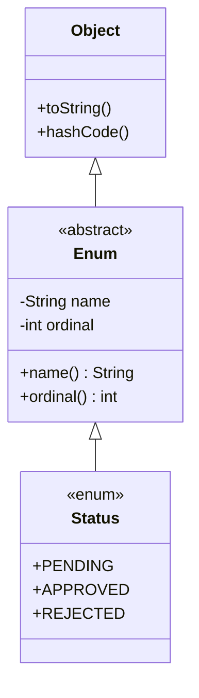

In many programming languages (like C or C++), an `enum` is nothing more than a glorified integer. Behind the scenes, `RED` is just `0`, and `BLUE` is just `1`.

Java architects looked at this and said: *"No. In Java, everything is an Object."*

In Java, an `enum` is a **full-blown, immensely powerful Class**. It can have instance variables, constructors, methods, and it even inherently guarantees Thread-Safe Singleton instantiation.

## 1. The Anatomy of an Enum

When you define an Enum, the Java compiler performs magic behind the scenes. 

```java
public enum Status {
    PENDING,
    APPROVED,
    REJECTED;
}
```

If we peek at the Bytecode the compiler generates for the above code, it actually creates a final class that looks exactly like this:

```java
// What the JVM actually compiles:
public final class Status extends java.lang.Enum<Status> {
    public static final Status PENDING = new Status("PENDING", 0);
    public static final Status APPROVED = new Status("APPROVED", 1);
    public static final Status REJECTED = new Status("REJECTED", 2);
    
    private Status(String name, int ordinal) { 
        super(name, ordinal); 
    }
}
```

### The Enum Inheritance Tree
Because your `enum` secretly extends `java.lang.Enum`, **an Enum cannot extend any other class** (since Java doesn't support multiple inheritance). However, an Enum *can* implement interfaces!



## 2. Adding State and Behavior

Because Enums are classes, you can treat them exactly like classes! This is incredibly powerful for associating strict data with constants.

Let's build a `Planet` enum that holds actual scientific data.

```java
public enum Planet {
    // 1. The Constants (calling the constructor below)
    EARTH(5.97e24, 6371.0),
    MARS(0.642e24, 3389.5),
    JUPITER(1898e24, 69911.0);

    // 2. Instance Variables (State)
    private final double massKg;
    private final double radiusKm;
    
    // Universal gravitational constant
    private static final double G = 6.67300E-11;

    // 3. Constructor
    // Note: Enum constructors are IMPLICITLY private. You cannot instantiate them outside!
    Planet(double massKg, double radiusKm) {
        this.massKg = massKg;
        this.radiusKm = radiusKm;
    }

    // 4. Instance Methods (Behavior)
    public double surfaceGravity() {
        return G * massKg / (radiusKm * radiusKm);
    }
    
    public double getMassKg() {
        return massKg;
    }
}
```

Now, instead of storing `mass` and `radius` in some external database or `HashMap`, the data is strictly bound to the Enum itself!
`System.out.println(Planet.MARS.surfaceGravity());`

## 3. The Ultimate Singleton Guarantee

In the previous module, we looked at how hard it is to create a perfectly thread-safe Singleton using static nested classes (the Bill Pugh pattern).

The absolute safest way to create a Singleton in Java is to use a single-element Enum.

```java
public enum DatabaseConnection {
    INSTANCE;
    
    private Connection conn;
    
    DatabaseConnection() {
        // Initialize connection
    }
    
    public Connection getConnection() { return conn; }
}
```
Why is this the best way?
1. **Thread-Safe**: The JVM guarantees that Enum constants are instantiated exactly once, serially, when the class is loaded.
2. **Serialization-Safe**: Normal singletons can be broken if you serialize and deserialize them (the JVM creates a second object). Enums have special serialization rules built into the JVM that completely prevent duplicate instances from ever being created.
3. **Reflection-Safe**: You cannot use the Reflection API to hack into an Enum constructor and create a second instance. The JVM outright blocks it.

## 4. Enums with Abstract Methods (The Strategy Pattern)

What if you want each Enum constant to behave differently? You can define an `abstract` method inside the Enum, forcing each constant to implement it!

```java
public enum Calculator {
    ADD {
        @Override
        public double calculate(double a, double b) { return a + b; }
    },
    SUBTRACT {
        @Override
        public double calculate(double a, double b) { return a - b; }
    };

    // Every constant MUST implement this!
    public abstract double calculate(double a, double b);
}
```
`double result = Calculator.ADD.calculate(10, 5); // returns 15.0`

## 5. Modern Switch Expressions (Java 14+)

Enums pair beautifully with Java 14's modern `switch` expressions. 
The modern switch uses `->` (arrow syntax) to prevent "fall-through" bugs (no `break;` needed!), and it can actually return a value.

```java
public String getAlienName(Planet planet) {
    // We are returning the result of the switch expression!
    return switch (planet) {
        case EARTH -> "Human";
        case MARS -> "Martian";
        case JUPITER -> {
            // If you need a multi-line block, use 'yield' to return the value
            System.out.println("Calculating Jovian lifeforms...");
            yield "Jovian"; 
        }
        // Notice: NO DEFAULT CASE!
    };
}
```

> [!TIP]
> **Exhaustiveness Checking**: Notice there is no `default:` case in the code above? Because the compiler knows exactly how many `Planet` constants exist, if you handle all of them in the switch, it doesn't require a `default` case! If another developer later adds `SATURN` to the Enum, the compiler will instantly throw an error on this switch statement, forcing them to handle `SATURN`. This eliminates countless runtime bugs.

---

## 🎯 Interview Questions

**1. Can an Enum extend another class?**
> *Answer:* No. Every Enum implicitly extends `java.lang.Enum`. Because Java enforces single class inheritance, it cannot extend anything else. However, it can implement interfaces.

**2. Why is an Enum the safest way to implement a Singleton?**
> *Answer:* It provides three absolute guarantees at the JVM level: 1) Thread-safe instantiation via the Classloader, 2) Protection against Reflection attacks (the JVM prevents reflection from invoking enum constructors), and 3) Built-in Serialization protection that prevents duplicate objects during deserialization.

**3. What is the difference between `name()` and `toString()` on an Enum?**
> *Answer:* `name()` is a `final` method that returns the exact string name of the constant as declared in the source code (e.g., "MARS"); it cannot be overridden. `toString()` returns the same thing by default, but it *can* be overridden by the developer to provide a more user-friendly string (e.g., "The Red Planet").
