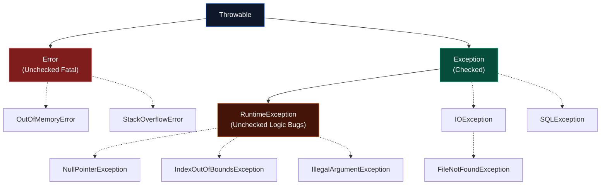

Errors are an inevitable part of software development. Databases go down, network connections drop, and users input invalid data. 
In Java, error management is handled through a highly structured Object-Oriented mechanism called **Exception Handling**.

A "Java God" doesn't just know how to write a `try-catch` block; they know exactly how the JVM unwinds the Thread Stack, why exceptions are incredibly expensive for performance, and the massive philosophical debate between Checked and Unchecked exceptions.

## 1. The `Throwable` Hierarchy

In Java, every exception is an Object. Specifically, they all inherit from a master class called `java.lang.Throwable`.



### The Three Branches of Trouble

1. **`Error` (Unchecked)** 
   These are catastrophic JVM failures. You should **never** attempt to catch or handle an `Error`. If these happen, the JVM is actively crashing, and there is nothing your code can do to save it.
   - *Examples*: 
     - `OutOfMemoryError`: The JVM Heap is completely full and the Garbage Collector cannot free any space.
     - `StackOverflowError`: A recursive method has called itself too many times, blowing up the thread's memory stack.
     - `NoClassDefFoundError`: The Classloader failed to find a required `.class` file at runtime.

2. **`Exception` (Checked)**
   These represent external, anticipated problems outside of the JVM's control (I/O, databases, networks). The Java compiler **forces** you to either catch these or declare them.
   - *Examples*: 
     - `IOException`: A generic network or file system failure.
     - `FileNotFoundException`: Attempting to read a file that has been deleted or moved.
     - `SQLException`: The database connection dropped, or you wrote a malformed SQL query.

3. **`RuntimeException` (Unchecked)**
   These are a specific subclass of `Exception`. They represent **logic bugs** written by the developer. The compiler does *not* force you to handle these, because you shouldn't handle them—you should fix your broken code!
   - *Examples*: 
     - `NullPointerException`: You tried to call a method on a reference variable that points to `null`.
     - `IndexOutOfBoundsException`: You tried to access array index `10`, but the array only has `5` elements.
     - `IllegalArgumentException`: You passed `-1` to a method that strictly requires a positive integer.

## 2. Checked vs Unchecked Exceptions

The debate over Checked vs Unchecked exceptions is one of the most fiercely debated topics in Java history.

### Checked Exceptions (The "Handle or Declare" Rule)
If a method throws a Checked Exception, the Java Compiler holds a gun to your head. You have exactly two choices:
1. **Handle it**: Wrap the dangerous code in a `try-catch` block.
2. **Declare it**: Add `throws MyException` to your method signature, passing the responsibility to whoever called your method.

```java
import java.io.File;
import java.io.FileReader;
import java.io.FileNotFoundException;

public class FileUploader {
    // We choose to DECLARE it, forcing the caller to deal with it.
    public void uploadFile(String path) throws FileNotFoundException {
        // FileReader throws a Checked Exception. 
        // If we don't handle or declare it, the code will NOT compile.
        FileReader reader = new FileReader(new File(path)); 
    }
}
```

### The Modern Consensus on Checked Exceptions
When Java was created in the 90s, Checked Exceptions were seen as a brilliant idea. However, 30 years later, the modern software engineering consensus (and the designers of modern languages like Kotlin and C#) agree: **Checked Exceptions are mostly a mistake.**
They clutter codebases with endless `try-catch` boilerplate and break the Open/Closed Principle when changing method signatures.

**Best Practice**: When creating custom exceptions for your application (e.g., `UserNotFoundException`), almost always extend `RuntimeException` (Unchecked).

## 3. The `try-catch-finally` Trap

The `finally` block is guaranteed to execute, regardless of whether an exception was thrown or not. It is typically used to clean up resources (like closing database connections).

However, there is a massive trap hiding in `finally`.

> [!WARNING]
> **The Swallowed Exception Trap**: NEVER use a `return` statement inside a `finally` block! 

```java
public int dangerousMethod() {
    try {
        throw new RuntimeException("BOOM! The database crashed!");
    } finally {
        // FATAL MISTAKE: Returning from finally overrides everything!
        return 0; 
    }
}
```
If you run this code, the application will return `0` and **silently swallow the exception**. The crash will never be logged, and you will spend days trying to figure out why your database isn't working!

## 4. `try-with-resources` (Java 7+)

Because developers constantly forgot to close files and database connections (causing massive memory leaks), Java 7 introduced the `try-with-resources` statement.

Any object that implements the `java.lang.AutoCloseable` interface can be declared inside the parenthesis of a `try` block. The JVM guarantees it will automatically call `.close()` on that object the moment the block ends, successfully or otherwise.

```java
public void readData(String filePath) {
    // The FileReader is declared INSIDE the try() parentheses.
    // We no longer need a 'finally' block!
    try (FileReader reader = new FileReader(filePath)) {
        int data = reader.read();
        System.out.println(data);
    } catch (IOException e) {
        System.err.println("Failed to read file: " + e.getMessage());
    }
} // <--- The JVM automatically calls reader.close() right here!
```

### Suppressed Exceptions
What happens if the `try` block throws an exception, and then the automatic `.close()` method *also* throws an exception?
The JVM is smart. It throws the *primary* exception (from the try block), and attaches the closing exception as a **Suppressed Exception**. You can retrieve it using `e.getSuppressed()`.

## 5. JVM Mechanics: The Cost of Stack Traces

Why do senior developers say "Don't use Exceptions for control flow"? (e.g., using a `catch` block to handle a normal user entering a wrong password).

Because Exceptions are **incredibly slow and expensive**.

When you write `throw new RuntimeException();`, the JVM doesn't just create an object. The parent `Throwable` constructor immediately executes a native JVM method called `fillInStackTrace()`. 

To fill in the stack trace, the JVM must:
1. Freeze the current thread.
2. Walk backwards down the entire Thread Stack frame-by-frame.
3. Record the exact class name, method name, and file line number for every single method call that led to this point.

In a modern Microservice architecture, a stack trace can easily be 150 frames deep (passing through Spring Boot, Tomcat, and proxies). Walking this stack takes massive CPU cycles.

### The "Java God" Optimization: Exception Caching
If you are building a high-throughput trading engine processing 100,000 requests per second, and you *must* throw a specific exception repeatedly, you can disable the stack trace entirely to make throwing it as fast as returning a boolean!

```java
public class FastException extends RuntimeException {
    
    // Override fillInStackTrace to do absolutely nothing!
    @Override
    public synchronized Throwable fillInStackTrace() {
        return this; 
    }
}
```
Now, throwing `FastException` is lightning fast, but you won't get line numbers if it crashes. Use this strictly for high-performance edge cases!

---

## 🎯 Interview Questions

**1. What is the difference between a Checked and Unchecked Exception?**
> *Answer:* Checked Exceptions (extend `Exception`) are verified by the compiler, forcing the developer to either handle them with `try-catch` or declare them with `throws`. Unchecked Exceptions (extend `RuntimeException`) represent programming logic errors and do not require explicit handling by the compiler.

**2. Can you catch an `Error`? Should you?**
> *Answer:* You technically *can* catch an `Error` (since it inherits from `Throwable`), but you absolutely **should not**. Errors represent catastrophic JVM failures (like `OutOfMemoryError`). Catching them will only mask the fatal crash, leaving the JVM in an unpredictable, corrupted state.

**3. Why is `try-with-resources` better than a `finally` block for closing streams?**
> *Answer:* `try-with-resources` eliminates boilerplate code, prevents memory leaks by guaranteeing the `close()` method is called, and elegantly handles "Suppressed Exceptions" if both the try block and the close method throw an exception simultaneously.
