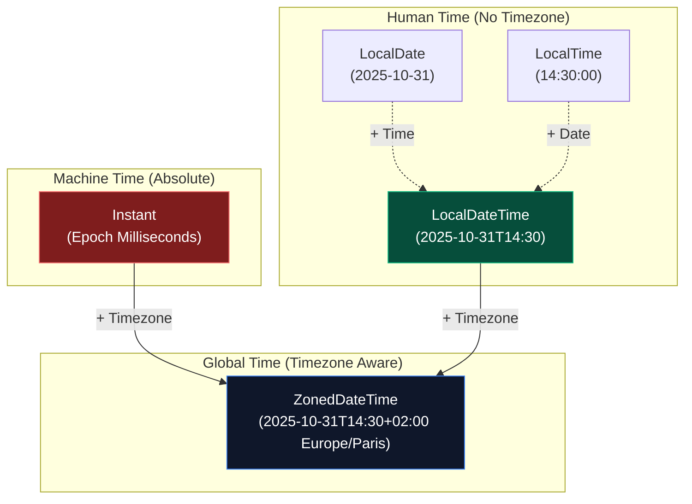

For the first 15 years of Java's existence, developers suffered through some of the most infamously terrible APIs in software engineering history. 
Specifically, dealing with Dates and HTTP requests was a nightmare that required third-party libraries like Joda-Time and Apache HttpClient.

Modern Java (Java 8 to 11+) completely rebuilt these core systems. A "Java God" understands exactly *why* the old systems failed, and the architectural brilliance of the new APIs.

## 1. The Tragedy of `java.util.Date`

If you are maintaining legacy code, you will encounter `java.util.Date` and `java.util.Calendar`. They are architectural disasters for several reasons:

1. **They are Mutable**: You could pass a `Date` object to a helper method, and that method could silently change the date to a week later using `.setTime()`. This broke the fundamental rules of data integrity.
2. **Not Thread-Safe**: Because they were mutable, sharing a `SimpleDateFormat` or `Calendar` across multiple threads would frequently result in completely corrupted dates in production databases.
3. **Terrible API Design**: In `java.util.Date`, years started at 1900, and months were **0-indexed** (January was `0`, December was `11`), but days were 1-indexed. This caused catastrophic off-by-one errors globally.

## 2. The Modern `java.time` API (JSR-310)

In Java 8, the architects completely scrapped the old system and introduced `java.time` (heavily inspired by Joda-Time). 
The core philosophy of the new API is **Immutability**. Every single class in `java.time` is completely immutable and intrinsically thread-safe.

### Human Time vs Machine Time



### Local Time (No Timezones)
Use these when the timezone doesn't matter (e.g., a birthday, or a local alarm clock).

```java
// Current date: 2026-07-14
LocalDate today = LocalDate.now(); 

// Math is incredibly easy and IMMUTABLE.
// This creates a NEW object, 'today' is untouched.
LocalDate nextWeek = today.plusDays(7); 

// Constructing a specific date (Notice: Months are FINALLY 1-indexed!)
LocalDate birthDate = LocalDate.of(1995, Month.OCTOBER, 31);
```

### Zoned Time & Machine Time
If you are saving a timestamp to a database, or coordinating events across the globe, you must use Timezones or Absolute Epoch time.

```java
// 1. ZonedDateTime: Human readable, timezone aware.
ZoneId tokyoZone = ZoneId.of("Asia/Tokyo");
ZonedDateTime tokyoTime = ZonedDateTime.now(tokyoZone);

// 2. Instant: Machine Time. The exact nanosecond since Jan 1, 1970 (UTC).
// Always use Instant for database timestamps!
Instant timestamp = Instant.now(); 

// Converting Human Time to Machine Time
Instant tokyoInstant = tokyoTime.toInstant();
```

### Period vs Duration
Measuring the time *between* two dates is finally standardized.
- **`Period`**: Measures time in human calendar units (Years, Months, Days).
- **`Duration`**: Measures absolute machine time (Hours, Minutes, Seconds, Nanoseconds).

```java
LocalDate start = LocalDate.of(2020, 1, 1);
LocalDate end = LocalDate.now();
Period gap = Period.between(start, end);
System.out.println("Years passed: " + gap.getYears());

Instant startTask = Instant.now();
// ... do expensive work ...
Instant endTask = Instant.now();
Duration timeTaken = Duration.between(startTask, endTask);
System.out.println("Task took " + timeTaken.toMillis() + " ms");
```

### Formatting and Parsing (Thread-Safe!)
In the old days, developers used `SimpleDateFormat` to parse dates. It was horribly broken and not thread-safe. JSR-310 introduced `DateTimeFormatter`, which is completely immutable and thread-safe.

```java
// 1. Formatting (Date to String)
LocalDateTime now = LocalDateTime.now();
DateTimeFormatter formatter = DateTimeFormatter.ofPattern("yyyy-MM-dd HH:mm:ss");
String text = now.format(formatter); // e.g., "2026-10-31 14:30:00"

// 2. Parsing (String to Date)
LocalDate parsedDate = LocalDate.parse("2026-10-31", DateTimeFormatter.ISO_DATE);
```

### The Legacy Conversion Bridge
If you are working with an older database driver that still returns a `java.util.Date`, you must convert it to the modern API immediately to ensure thread-safety.

```java
// Legacy to Modern
java.util.Date legacyDate = new java.util.Date();
Instant modernInstant = legacyDate.toInstant();
LocalDateTime modernDateTime = LocalDateTime.ofInstant(modernInstant, ZoneId.systemDefault());

// Modern to Legacy
java.util.Date backToLegacy = java.util.Date.from(modernInstant);
```

---

## 3. The Java 11 `HttpClient`

Prior to Java 11, the built-in `HttpURLConnection` was practically unusable. It was synchronous-only, painfully difficult to configure, and required writing loops just to read a simple JSON response from an `InputStream`. 

Java 11 introduced `java.net.http.HttpClient`, a modern, builder-pattern based API that supports HTTP/1.1, HTTP/2, and WebSockets natively.

### Synchronous (Blocking) Requests

```java
import java.net.URI;
import java.net.http.HttpClient;
import java.net.http.HttpRequest;
import java.net.http.HttpResponse;
import java.time.Duration;

public class NetworkMaster {
    public void fetchUserData() throws Exception {
        // 1. Build the Client (Thread-safe, share this globally!)
        HttpClient client = HttpClient.newBuilder()
                .version(HttpClient.Version.HTTP_2)
                .connectTimeout(Duration.ofSeconds(10))
                .build();

        // 2. Build the Request
        HttpRequest request = HttpRequest.newBuilder()
                .uri(URI.create("https://api.github.com/users/octocat"))
                .header("Accept", "application/json")
                .GET()
                .build();

        // 3. Send synchronously (Blocks the thread until the response arrives)
        HttpResponse<String> response = client.send(request, HttpResponse.BodyHandlers.ofString());
        
        System.out.println("Status Code: " + response.statusCode());
        System.out.println("JSON Body: " + response.body());
    }
}
```

### Asynchronous (Non-Blocking) Requests
In modern reactive microservices, blocking a thread while waiting for a network response is a massive performance bottleneck. The new `HttpClient` supports fully Asynchronous requests returning a `CompletableFuture`.

```java
public void fetchAsync() {
    HttpClient client = HttpClient.newHttpClient();
    HttpRequest request = HttpRequest.newBuilder(URI.create("https://api.github.com/users/octocat")).build();

    // sendAsync returns immediately. The thread is NOT blocked.
    client.sendAsync(request, HttpResponse.BodyHandlers.ofString())
          .thenApply(HttpResponse::body)
          .thenAccept(body -> System.out.println("Received: " + body))
          .exceptionally(err -> {
              System.err.println("Network failure: " + err);
              return null;
          });
          
    System.out.println("This prints BEFORE the network response arrives!");
}
```
> [!TIP]
> **HttpClient Reusability**: The `HttpClient` instance is completely thread-safe. You should instantiate it **once** (as a `private static final` or a Spring Bean) and reuse it across your entire application to take advantage of connection pooling and HTTP/2 multiplexing!

### Advanced: POST Requests, JSON, and Authentication
The builder pattern makes it incredibly easy to add Headers, configure Basic Authentication, and stream JSON bodies.

```java
public void createPost() throws Exception {
    HttpClient client = HttpClient.newBuilder()
            // Configures automatic Basic Authentication
            .authenticator(new Authenticator() {
                @Override
                protected PasswordAuthentication getPasswordAuthentication() {
                    return new PasswordAuthentication("admin", "secret123".toCharArray());
                }
            })
            .build();

    // A raw JSON string (In reality, you'd use Jackson or Gson to generate this)
    String jsonBody = "{\"title\":\"foo\",\"body\":\"bar\",\"userId\":1}";

    HttpRequest request = HttpRequest.newBuilder()
            .uri(URI.create("https://jsonplaceholder.typicode.com/posts"))
            .header("Content-Type", "application/json")
            // BodyPublishers.ofString streams the JSON to the server
            .POST(HttpRequest.BodyPublishers.ofString(jsonBody))
            .build();

    HttpResponse<String> response = client.send(request, HttpResponse.BodyHandlers.ofString());
    System.out.println("Created Resource ID: " + response.body());
}
```

---

## 4. The Billion Dollar Mistake: `Optional<T>`

In 1965, Tony Hoare invented the `null` reference, which he later called his "Billion Dollar Mistake" because of the countless crashes and vulnerabilities it caused. In Java, this manifests as the dreaded `NullPointerException`.

Java 8 introduced `java.util.Optional<T>` to forcefully eliminate `null` from modern architectures.

### The Problem
```java
// Legacy code: Returns a User, or null if not found.
User user = database.findUser("alice");
// If alice doesn't exist, this throws a NullPointerException and crashes the server!
System.out.println(user.getEmail()); 
```

### The `Optional` Solution
An `Optional` is a wrapper box. It either contains a value, or it is completely empty. It forces the developer to acknowledge that the value might be missing.

```java
// Modern code: Returns Optional<User>
Optional<User> optUser = database.findUserOptional("alice");

// 1. The Safe Way (Functional)
optUser.ifPresent(user -> System.out.println(user.getEmail()));

// 2. Providing a Default Value (The true power of Optional)
User safeUser = optUser.orElse(new User("default_guest"));

// 3. Throwing a custom Exception if missing
User guaranteedUser = optUser.orElseThrow(() -> new UserNotFoundException("Alice is missing!"));
```

> [!WARNING]
> **Anti-Pattern**: Never call `.get()` on an `Optional` without checking `.isPresent()` first. If the box is empty, `.get()` will throw a `NoSuchElementException`, which completely defeats the purpose of using `Optional` to prevent crashes! Better yet, avoid `.get()` entirely and use `.orElse()` or `.ifPresent()`.

---

## 🎯 Interview Questions

**1. Why was `java.util.Date` deprecated in favor of `java.time.LocalDate`?**
> *Answer:* `java.util.Date` was mutable (destroying thread-safety), had poor timezone handling, and suffered from terrible design flaws like 0-indexed months and year offsets from 1900. `java.time` fixed this by making everything absolutely immutable, thread-safe, and logically separated into Human Time (`LocalDateTime`) and Machine Time (`Instant`).

**2. What is the difference between a `Period` and a `Duration`?**
> *Answer:* `Period` is used to measure conceptual calendar time (Years, Months, Days), whereas `Duration` measures absolute physical time (Hours, Minutes, Seconds, Nanoseconds).

**3. Why is `sendAsync` in the Java 11 HttpClient important for high-performance servers?**
> *Answer:* Standard `send()` blocks the calling Thread until the HTTP response arrives, wasting CPU resources while waiting for network I/O. `sendAsync` leverages non-blocking I/O and returns a `CompletableFuture`, allowing the Thread to process other user requests while waiting for the network, massively increasing the server's throughput.
