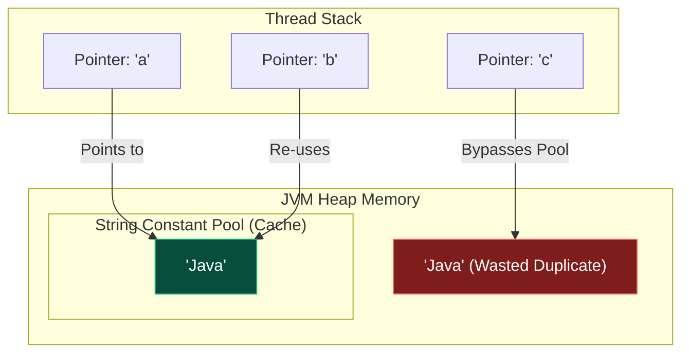

In enterprise applications, text processing accounts for a massive percentage of CPU and memory usage. If you don't understand exactly how Java handles text in memory, you will accidentally crash your servers with out-of-memory errors and sluggish performance.

To prevent this, the architects of the JVM created a highly optimized, heavily cached architecture specifically for Strings.

## 1. The Core Philosophy: String Immutability

In Java, `String` is not a primitive type; it is an Object. 
More importantly, **Strings are absolutely, unconditionally Immutable**. Once a String object is created in memory, its contents can never be changed. 

If you attempt to modify a String (e.g., `s.toUpperCase()`), the JVM does not change the original object. Instead, it allocates a completely new block of memory, creates a new String, and returns the pointer to that new object.

```java
String password = "admin";
password.toUpperCase(); // We ignore the returned value!

// Prints "admin", NOT "ADMIN". The original string is untouched.
System.out.println(password); 
```

### Why make Strings Immutable?
1. **Security**: Strings are used for database URLs, network connections, and file paths. If a String were mutable, a hacker could pass validation checks, and then modify the string memory concurrently before the file is opened!
2. **Thread Safety**: Because they can never change, Strings are intrinsically thread-safe. You can share them across 10,000 threads simultaneously without any `synchronized` locks.
3. **Caching (The String Pool)**: Because Strings are immutable, the JVM can safely reuse them. If ten different classes use the word `"ERROR"`, the JVM only creates one copy in memory!

## 2. The String Constant Pool (SCP)

To facilitate this massive caching, the JVM has a special memory region called the **String Constant Pool (SCP)**. (Prior to Java 7, the SCP lived in the PermGen. Today, it lives on the standard Heap).

When you create a String using a literal (double quotes), the JVM first checks the SCP. If the string already exists, it returns a pointer to the existing object. If it doesn't exist, it creates it in the pool.

### The `new String()` Trap
If you explicitly use the `new` keyword, you bypass the cache entirely. The JVM is forced to create a brand new object on the general Heap, wasting memory!

```java
// 1. JVM checks the Pool. "Java" doesn't exist. Creates it in Pool.
String a = "Java"; 

// 2. JVM checks the Pool. "Java" exists! Returns the exact same pointer.
String b = "Java"; 

// 3. JVM ignores the Pool. Creates a totally new object on the Heap!
String c = new String("Java"); 
```

### Memory Architecture Diagram



## 3. The `==` vs `.equals()` Catastrophe

Because of the memory layout above, understanding string equality is critical.

- The `==` operator compares **Memory Addresses** (Pointers). Do these two variables point to the exact same physical byte in RAM?
- The `.equals()` method compares **Data Value**. Are the characters inside the object identical?

```java
String a = "Java";
String b = "Java";
String c = new String("Java");

System.out.println(a == b);      // TRUE! (Both point to the same Pool object)
System.out.println(a == c);      // FALSE! (One is in the Pool, one is on the Heap)

System.out.println(a.equals(c)); // TRUE! (The character arrays contain the same text)
```

> [!CAUTION]
> **The Golden Rule**: Never, ever use `==` to compare Strings in Java. Always use `.equals()`. Even if `==` appears to work during testing due to Pool caching, it will violently fail in production when strings are dynamically generated at runtime!

## 4. Manual Interning

If you dynamically generate a lot of Strings at runtime (e.g., reading a massive CSV file where the word "Complete" appears 50,000 times), those strings will normally be created on the standard Heap, eating gigabytes of RAM.

You can manually force a Heap string into the String Pool using the `.intern()` method!

```java
// Simulated database read. This goes to the Heap.
String status = new String("Complete"); 

// Moves "Complete" to the Pool (or returns the existing one), freeing the Heap!
String cachedStatus = status.intern(); 
```

> [!WARNING]
> **The Java 6 Interning Crash**: If you are maintaining a legacy Java 6 application, NEVER use `.intern()` aggressively. In Java 6, the String Pool was located in the **PermGen** space, which had a fixed, tiny size (usually 64MB). Interning too many strings would instantly crash the JVM with `OutOfMemoryError: PermGen space`. In Java 7+, the pool was moved to the main Heap, meaning it can expand dynamically and be garbage collected, making `.intern()` safe again!

## 5. Compile-Time Constant Folding

If you concatenate strings using the `+` operator, you might think it's bad for performance. But what if you concatenate string *literals*?

```java
// Does this create 3 strings and use StringBuilder?
String greeting = "Hello" + " " + "World";
```
No! The Java Compiler is incredibly smart. It performs an optimization called **Constant Folding**. Because all three parts are literals known at compile-time, the compiler evaluates the result *before* it even generates the bytecode.
The compiled `.class` file literally just contains:
`String greeting = "Hello World";`

## 6. The Performance Trap: `StringBuilder`

Because Strings are immutable, concatenating them in a loop is a performance disaster.

```java
String result = "";
// Loop 100,000 times
for (int i = 0; i < 100000; i++) {
    // DISASTER!
    result = result + i; 
}
```
Every time the loop runs, the JVM must:
1. Allocate memory for a brand new String.
2. Copy the entire contents of `result` into the new memory.
3. Append `i`.
4. Discard the old `result` String.

This loop creates 100,000 orphaned String objects on the Heap. The CPU will max out at 100%, and the Garbage Collector will constantly pause your application to clean up the mess.

### The Solution: `StringBuilder`
`StringBuilder` is a **mutable** class. Under the hood, it maintains a dynamic character array. When you append text, it just modifies the existing array in memory. It only creates a `String` object at the very end when you call `.toString()`.

```java
StringBuilder builder = new StringBuilder();
for (int i = 0; i < 100000; i++) {
    builder.append(i); // Lightning fast, no objects created!
}
String result = builder.toString(); // Creates exactly ONE string.
```

> [!NOTE]
> **`StringBuilder` vs `StringBuffer`**
> In older Java code, you might see `StringBuffer`. `StringBuffer` is exactly the same as `StringBuilder`, but every method is `synchronized` (thread-safe). Because synchronization locks are extremely slow, you should almost always use `StringBuilder` unless multiple threads are actively writing to the exact same buffer simultaneously.

## 6. JVM Magic: Compact Strings (Java 9+)

*This is Java God territory.*

Prior to Java 9, every `String` was backed by a `char[]` array. In Java, a `char` is UTF-16, meaning it always takes up **2 Bytes** of memory. However, statistical analysis showed that 95% of all strings in enterprise applications are purely Latin-1 characters (A-Z, 0-9), which only require **1 Byte**. 
Java was wasting half of its String memory!

In Java 9, the architecture was completely rewritten. Strings are now backed by a `byte[]` array and a hidden `coder` flag. 
- If the string only contains Latin-1 characters, the JVM stores it using 1 byte per character. 
- If it detects Chinese, Arabic, or Emojis, it dynamically flips the `coder` flag and expands the array to 2 bytes per character. 

This invisible upgrade instantly reduced global Java memory consumption by over 20%!

### `StringConcatFactory` (Java 9+)
When you *do* use the `+` operator with variables (not literals), older Java versions compiled it into `new StringBuilder().append(a).append(b).toString()`.
Since Java 9, the compiler instead generates an `invokedynamic` instruction pointing to `StringConcatFactory`. This allows the JVM to dynamically choose the fastest possible concatenation strategy at runtime (like pre-allocating the exact size of the final byte array) without you ever needing to recompile your code!

## 7. Essential String Methods

While understanding memory is crucial for a Java God, you still need to know how to manipulate text daily. Here are the most essential methods:

```java
String text = "  Java Masterclass  ";

// 1. Cleaning
text.trim(); // Returns "Java Masterclass" (removes leading/trailing spaces)
text.strip(); // Java 11+: Like trim, but understands full Unicode whitespace

// 2. Extracting
text.substring(2, 6); // Returns "Java" (startIndex is inclusive, endIndex is exclusive)

// 3. Searching
text.contains("Master"); // Returns true
text.indexOf("v"); // Returns 4

// 4. Splitting & Joining
String[] parts = "apple,banana,cherry".split(","); 
String csv = String.join(",", "apple", "banana", "cherry");

// 5. Modern Java 11+ additions
" ".isBlank(); // true (better than isEmpty() which only checks length)
"Java".repeat(3); // "JavaJavaJava"
```

---

## 🎯 Interview Questions

**1. Why are Strings immutable in Java?**
> *Answer:* Immutability guarantees thread-safety without synchronization locks, ensures security when strings are used as classloader/network parameters, and allows the JVM to safely cache string literals in the String Constant Pool to save massive amounts of memory.

**2. What does the `.intern()` method do?**
> *Answer:* It checks the String Constant Pool for a string with the exact same sequence of characters. If found, it returns the reference from the pool. If not found, it adds the string to the pool and returns a reference to the newly pooled object.

**3. Why is `StringBuilder` faster than the `+` operator in a loop?**
> *Answer:* The `+` operator on an immutable String forces the JVM to allocate a brand new String object in memory, copy the old data, append the new data, and abandon the old object to the Garbage Collector. `StringBuilder` maintains a mutable internal array and simply resizes and appends data in-place, drastically reducing CPU cycles and Heap allocation.
